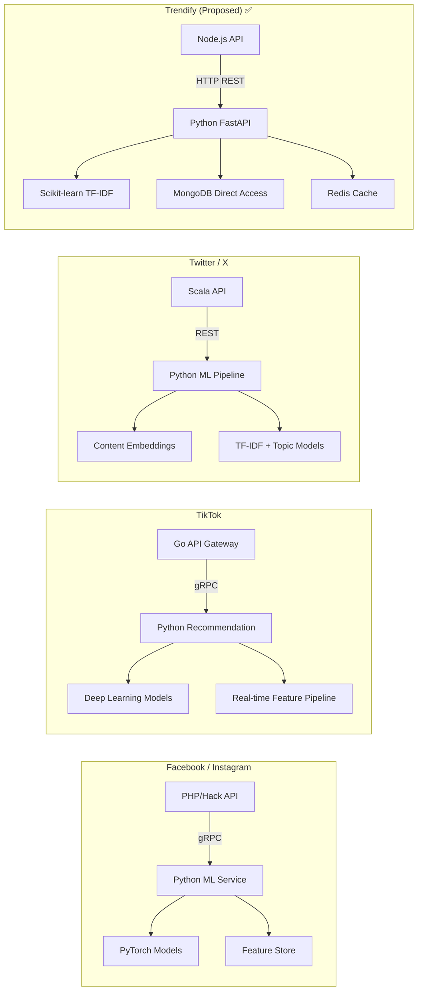
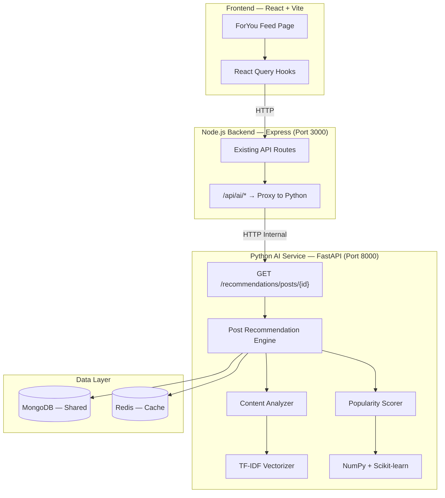
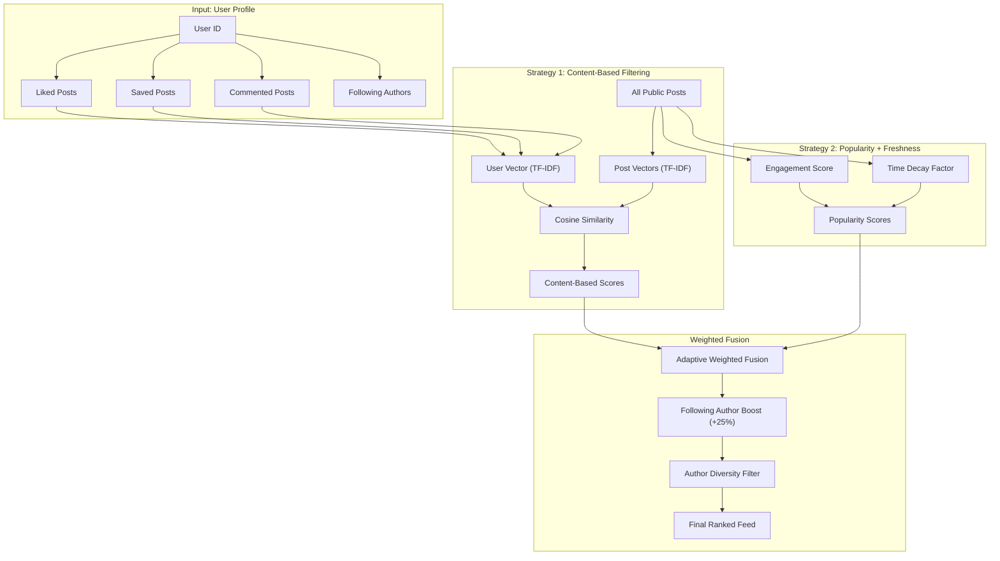
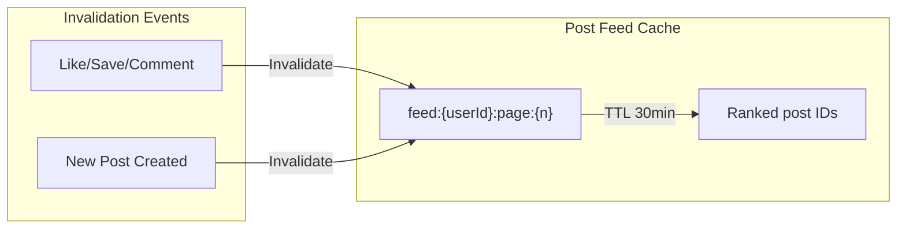

# Trendify AI Recommendation Engine — Implementation Plan

## 1. Tổng Quan

Xây dựng **AI Recommendation Engine** cho Trendify với 1 module chính:

| Module | Chức năng | Thuật toán chính |
|--------|----------|-----------------|
| 📰 **Smart Feed** | Gợi ý bài viết chủ đề tương tự trên ForYou | Content-Based Filtering (TF-IDF + Cosine Similarity) |

Module chạy trên **Python FastAPI microservice** — tách biệt với Node.js backend hiện tại.

---

## 2. Cách Các Hệ Thống Lớn Triển Khai



> [!NOTE]
> **Pattern chung**: Main API (bất kỳ ngôn ngữ nào) + **Python AI Service tách biệt**. Đây là chuẩn industry vì Python có ecosystem ML/AI tốt nhất thế giới. Trendify sẽ follow đúng pattern này.

---

## 3. Kiến Trúc Tổng Thể



### Communication Flow

```
Frontend → Node.js (auth + proxy) → Python FastAPI → MongoDB/Redis
```

Node.js làm nhiệm vụ:
1. **Authentication** — verify JWT token
2. **Proxy** — forward request đến Python service
3. Giữ nguyên business logic hiện tại

Python service:
1. **Trực tiếp đọc MongoDB** — dùng Motor (async pymongo)
2. **Cache kết quả vào Redis** — tránh tính toán lại
3. **Expose REST API** — FastAPI với auto-gen OpenAPI docs

---

## 4. Module: Smart Post Recommendation (ForYou Feed)

> [!IMPORTANT]
> Hiện tại trang **ForYou đang dùng fake data** (`fakeGetPosts`). Module này sẽ thay thế bằng AI-powered personalized feed.

### 4.1 Thuật Toán

Content-Based Filtering kết hợp Popularity scoring:



#### Thuật toán chi tiết:

```python
from sklearn.feature_extraction.text import TfidfVectorizer
from sklearn.metrics.pairwise import cosine_similarity
import numpy as np
from datetime import datetime, timedelta

class PostRecommendationEngine:
    
    async def recommend(self, user_id: str, limit: int = 20, page: int = 0):
        
        # ============ BUILD USER PROFILE ============
        # Lấy posts mà user đã tương tác
        liked_post_ids = await self._get_liked_posts(user_id)
        saved_post_ids = await self._get_saved_posts(user_id)
        commented_post_ids = await self._get_commented_posts(user_id)
        following_ids = await self._get_following_ids(user_id)
        
        interacted_ids = set(liked_post_ids + saved_post_ids + commented_post_ids)
        
        # ============ STRATEGY 1: CONTENT-BASED FILTERING ============
        # Xây dựng "user taste profile" từ content đã tương tác
        interacted_posts = await self.db.posts.find(
            {"_id": {"$in": list(interacted_ids)}}
        ).to_list(None)
        
        # Combine text: content + hashtags
        user_text = " ".join([
            self._post_to_text(p) for p in interacted_posts
        ])
        
        # Lấy candidate posts (public, chưa tương tác, 14 ngày gần)
        candidate_posts = await self.db.posts.find({
            "status": "active",
            "settings.visibility": "public",
            "_id": {"$nin": list(interacted_ids)},
            "createdAt": {"$gte": datetime.now() - timedelta(days=14)},
            "replyToId": None,  # Không lấy replies
        }).to_list(500)  # Limit candidates
        
        if not candidate_posts:
            return {"posts": [], "nextCursor": None}
        
        # TF-IDF Vectorization
        corpus = [user_text] + [self._post_to_text(p) for p in candidate_posts]
        tfidf = TfidfVectorizer(max_features=2000, ngram_range=(1, 2))
        vectors = tfidf.fit_transform(corpus)
        
        # Cosine similarity giữa user profile và mỗi candidate
        user_vec = vectors[0:1]
        post_vecs = vectors[1:]
        content_scores = cosine_similarity(user_vec, post_vecs).flatten()
        
        # ============ STRATEGY 2: POPULARITY + FRESHNESS ============
        pop_scores = []
        for post in candidate_posts:
            counters = post.get("counters", {})
            engagement = (
                counters.get("likeCount", 0) * 1.0 +
                counters.get("commentCount", 0) * 2.0 +
                counters.get("saveCount", 0) * 3.0 +
                counters.get("shareCount", 0) * 2.5
            )
            
            # Time decay: posts mới hơn được ưu tiên
            age_hours = (datetime.now() - post["createdAt"]).total_seconds() / 3600
            freshness = exp(-0.693 * age_hours / 72)  # Half-life 72 hours
            
            pop_scores.append(engagement * freshness)
        
        # Normalize tất cả scores
        pop_scores = self._min_max_normalize(np.array(pop_scores))
        content_scores = self._min_max_normalize(content_scores)
        
        # ============ ADAPTIVE WEIGHTED FUSION ============
        # Nếu user mới (ít tương tác) → tăng weight popularity
        interaction_count = len(interacted_ids)
        
        if interaction_count < 5:      # Cold start
            weights = {"content": 0.10, "popularity": 0.90}
        elif interaction_count < 20:
            weights = {"content": 0.40, "popularity": 0.60}
        elif interaction_count < 50:
            weights = {"content": 0.60, "popularity": 0.40}
        else:
            weights = {"content": 0.75, "popularity": 0.25}
        
        final_scores = (
            weights["content"] * content_scores +
            weights["popularity"] * pop_scores
        )
        
        # ============ FOLLOWING BOOST ============
        # Boost posts từ authors mà user follow (nhưng không quá dominate)
        following_set = set(following_ids)
        for i, post in enumerate(candidate_posts):
            if str(post["authorId"]) in following_set:
                final_scores[i] *= 1.25  # 25% boost
        
        # ============ AUTHOR DIVERSITY ============
        # Không cho quá 3 bài từ cùng 1 tác giả trong top results
        final_scores = self._apply_author_diversity(candidate_posts, final_scores)
        
        # Sort + paginate
        ranked_indices = np.argsort(-final_scores)
        
        return {
            "postIds": [str(candidate_posts[i]["_id"]) for i in ranked_indices[:limit]],
            "scores": [float(final_scores[i]) for i in ranked_indices[:limit]],
            "nextCursor": ...,
            "meta": {
                "strategy": weights,
                "candidateCount": len(candidate_posts),
                "userInteractions": interaction_count
            }
        }
    
    def _post_to_text(self, post) -> str:
        """Combine content + hashtags thành text cho TF-IDF"""
        parts = []
        if post.get("content"):
            parts.append(post["content"])
        for ht in post.get("hashtags", []):
            parts.append(ht["tag"])
            parts.append(ht["tag"])  # Repeat hashtags for emphasis
        return " ".join(parts)
```

### 4.2 Giải Thích Thuật Toán (cho đồ án trình bày)

#### TF-IDF (Term Frequency — Inverse Document Frequency)

| Thành phần | Công thức | Ý nghĩa |
|-----------|-----------|---------|
| **TF** | `tf(t,d) = count(t in d) / |d|` | Tần suất từ *t* xuất hiện trong document *d* |
| **IDF** | `idf(t) = log(N / df(t))` | Nghịch đảo số documents chứa từ *t* — từ hiếm có weight cao hơn |
| **TF-IDF** | `tfidf(t,d) = tf(t,d) × idf(t)` | Kết hợp: từ xuất hiện nhiều trong document nhưng ít trong corpus → quan trọng |

#### Cosine Similarity

```
cosine_sim(A, B) = (A · B) / (||A|| × ||B||)
```

- Đo góc giữa 2 vector TF-IDF
- Kết quả ∈ [0, 1]: 0 = hoàn toàn khác, 1 = giống nhau hoàn toàn
- **Ưu điểm**: không phụ thuộc vào độ dài document

#### Engagement Score (Popularity)

```
engagement = likeCount × 1.0 + commentCount × 2.0 + saveCount × 3.0 + shareCount × 2.5
```

- Comment quan trọng hơn like (thể hiện engagement sâu hơn)
- Save có weight cao nhất (user chủ động lưu = nội dung giá trị)

#### Time Decay (Freshness)

```
freshness = e^(-0.693 × age_hours / 72)
```

- Exponential decay với half-life 72 giờ
- Post 3 ngày tuổi: freshness ≈ 50%
- Post 1 tuần tuổi: freshness ≈ 18%

### 4.3 Cold Start Problem

Khi user mới chưa có tương tác:

| User Status | Content Weight | Popularity Weight | Chiến lược |
|------------|---------------|------------------|-----------|
| **0-4 interactions** | 10% | 90% | Gần như 100% popularity (trending posts) |
| **5-19 interactions** | 40% | 60% | Bắt đầu cá nhân hóa |
| **20-49 interactions** | 60% | 40% | Content-Based chiếm ưu thế |
| **50+ interactions** | 75% | 25% | Gợi ý chủ yếu dựa trên sở thích |

→ Hệ thống **tự động điều chỉnh weights** theo mức độ engagement của user — đây là điểm hay để trình bày trong đồ án.

---

## 5. Project Structure — `trendify-ai/`

```
trendify-ai/
├── app/
│   ├── __init__.py
│   ├── main.py                          # FastAPI entry point
│   ├── config.py                        # MongoDB, Redis, env configs
│   │
│   ├── routers/
│   │   ├── __init__.py
│   │   └── post_recommendations.py      # Post feed endpoints
│   │
│   ├── engines/
│   │   ├── __init__.py
│   │   └── post/
│   │       ├── __init__.py
│   │       └── engine.py                # Content-Based Filtering engine
│   │
│   ├── models/                          # Pydantic response models
│   │   ├── __init__.py
│   │   └── schemas.py
│   │
│   ├── services/
│   │   ├── __init__.py
│   │   ├── mongo_service.py             # Motor async client
│   │   └── redis_service.py             # Redis cache
│   │
│   └── utils/
│       ├── __init__.py
│       └── normalization.py             # Min-max, time decay utilities
│
├── tests/
│   └── test_post_engine.py
│
├── requirements.txt
├── Dockerfile
└── README.md
```

### `requirements.txt`

```
fastapi==0.115.12
uvicorn[standard]==0.34.3
motor==3.7.1
redis[hiredis]==5.3.0
numpy==2.2.5
scikit-learn==1.6.1
pydantic==2.11.3
pydantic-settings==2.9.1
python-dotenv==1.1.0
```

---

## 6. API Contract

### Node.js ↔ Python Communication

#### Post Recommendation - Gợi ý bài viết

```http
GET http://localhost:8000/api/recommendations/posts/{user_id}?limit=20&page=0

Response 200:
{
  "postIds": ["post_id_1", "post_id_2", ...],
  "scores": [0.92, 0.88, ...],
  "nextCursor": "1",
  "meta": {
    "strategy": { "content": 0.75, "popularity": 0.25 },
    "candidateCount": 500,
    "userInteractions": 45,
    "coldStart": false,
    "computeTimeMs": 120
  }
}
```

### Node.js Proxy Setup

```typescript
// trendify-backed/src/interfaces/routes/ai.route.ts
import { Router } from "express";
import axios from "axios";
import { authMiddleware } from "../middlewares";

const AI_SERVICE_URL = process.env.AI_SERVICE_URL || "http://localhost:8000";
const router = Router();

// Proxy ALL /api/ai/* requests to Python service
router.use("/ai", authMiddleware, async (req, res) => {
  try {
    const userId = res.locals.auth.userId;
    const pythonUrl = `${AI_SERVICE_URL}/api/recommendations${req.path}`;
    
    const response = await axios({
      method: req.method,
      url: pythonUrl,
      params: { ...req.query, userId },
      data: req.body,
      timeout: 5000,
    });
    
    res.json(response.data);
  } catch (error) {
    // Fallback: return empty suggestions if AI service is down
    res.json({ postIds: [], meta: { fallback: true } });
  }
});
```

---

## 7. Proposed Changes — Full File List

### Project: `trendify-ai/` (Python FastAPI)

| File | Mô tả |
|------|-------|
| ✅ `app/main.py` | FastAPI app, CORS, lifespan events |
| ✅ `app/config.py` | MongoDB URI, Redis, env vars |
| ✅ `app/routers/post_recommendations.py` | Post recommendation endpoints |
| ✅ `app/engines/post/engine.py` | Content-Based Filtering engine |
| ✅ `app/services/mongo_service.py` | Motor async MongoDB |
| ✅ `app/services/redis_service.py` | Redis caching |
| ✅ `app/models/schemas.py` | Pydantic schemas |
| ✅ `app/utils/normalization.py` | Min-max, time decay |
| ✅ `requirements.txt` | Dependencies |

### Backend: `trendify-backed/` (Node.js — Minimal changes)

| File | Mô tả |
|------|-------|
| [NEW] `src/interfaces/routes/ai.route.ts` | Proxy route → Python service |
| [MODIFY] `src/interfaces/routes/index.ts` | Register AI route |
| [MODIFY] `.env` | Add `AI_SERVICE_URL=http://localhost:8000` |

### Frontend: `trendify-portal/` (React)

| File | Mô tả |
|------|-------|
| [NEW] `src/hooks/useForYouFeed.ts` | React Query hook for AI-powered feed |
| [MODIFY] `src/pages/home/components/ForyouPage.tsx` | Replace `fakeGetPosts` → real AI feed |

---

## 8. Caching Strategy



---

## 9. Kế Hoạch Thực Thi

### Phase 1: Python Service Foundation ✅ (Đã hoàn thành)
- [x] Initialize `trendify-ai/` với FastAPI
- [x] Setup Motor (MongoDB) + Redis connections  
- [x] Health check endpoint
- [x] Content-Based Filtering engine

### Phase 2: Node.js Integration (1 ngày)
- [ ] Proxy route `/api/ai/*` → Python service
- [ ] Fallback handling khi Python service down
- [ ] Environment configuration

### Phase 3: Frontend Integration (2-3 ngày)
- [ ] `useForYouFeed` hook → replace `fakeGetPosts`
- [ ] ForYou page renders real AI-recommended posts
- [ ] Loading states, error handling
- [ ] Infinite scroll pagination

### Phase 4: Polish & Demo (1 ngày)
- [ ] Seed test data (nếu cần)
- [ ] Tune weights
- [ ] Performance optimization
- [ ] Demo recording

**Tổng thời gian ước tính: ~4-5 ngày**

---

## 10. Ý Tưởng Trình Bày Đồ Án

### Slide gợi ý:

1. **Problem Statement**: "Làm sao gợi ý bài viết phù hợp với sở thích người dùng trong mạng xã hội?"
2. **Solution Overview**: Kiến trúc microservice — tách biệt AI service bằng Python
3. **Algorithm Deep-Dive**:
   - Content-Based Filtering: TF-IDF + Cosine Similarity
   - Popularity + Freshness scoring
   - Cold Start handling — adaptive weights
   - Author diversity filter
4. **System Architecture**: Diagram microservice Node.js ↔ Python ↔ MongoDB
5. **Demo**: Live demo ForYou feed
6. **Evaluation**: So sánh kết quả trước/sau AI (precision, diversity)

### Thuật ngữ chuyên ngành để dùng:
- **Content-Based Filtering** — lọc dựa trên nội dung
- **TF-IDF Vectorization** — vector hóa văn bản (Term Frequency — Inverse Document Frequency)
- **Cosine Similarity** — độ tương đồng cosine
- **Cold Start Problem** — vấn đề khởi động lạnh
- **Time Decay** — suy giảm theo thời gian
- **Engagement Score** — điểm tương tác
- **Author Diversity** — đa dạng tác giả

---

## User Review Required

> [!IMPORTANT]
> **Câu hỏi cần trả lời trước khi tiếp tục:**
>
> 1. **ForYou feed**: AI feed sẽ **thay thế hoàn toàn** ForYou page hay muốn giữ song song (toggle switch)?
>
> 2. **Data scale**: Hiện có bao nhiêu users/posts/follows trong database? Cần seed thêm data để demo tốt hơn không?
>
> 3. **Timeline**: Bạn có bao nhiêu thời gian cho feature AI này?

> [!WARNING]
> **Post Recommendation cần đủ data**: Để TF-IDF hoạt động tốt, cần ít nhất:
> - ~50+ users  
> - ~200+ posts (có content/hashtags)
> - ~500+ likes/saves
>
> Nếu database hiện tại chưa đủ, tôi sẽ viết script seed data cho bạn.
