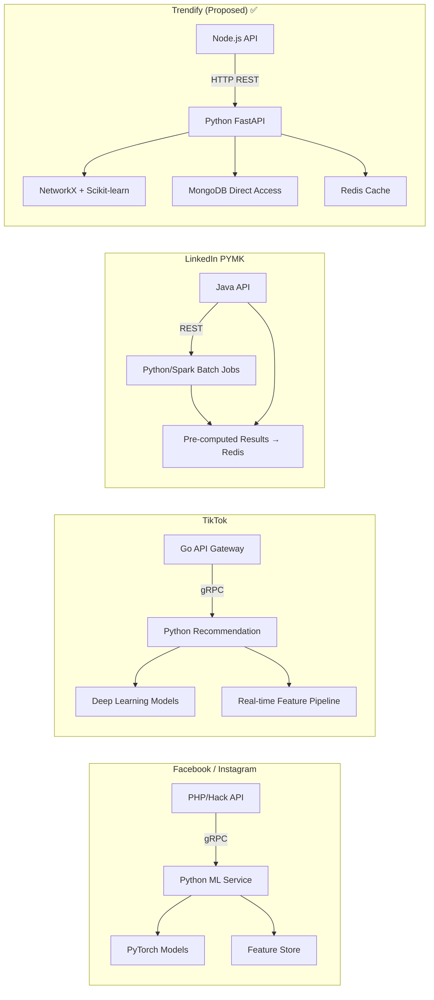
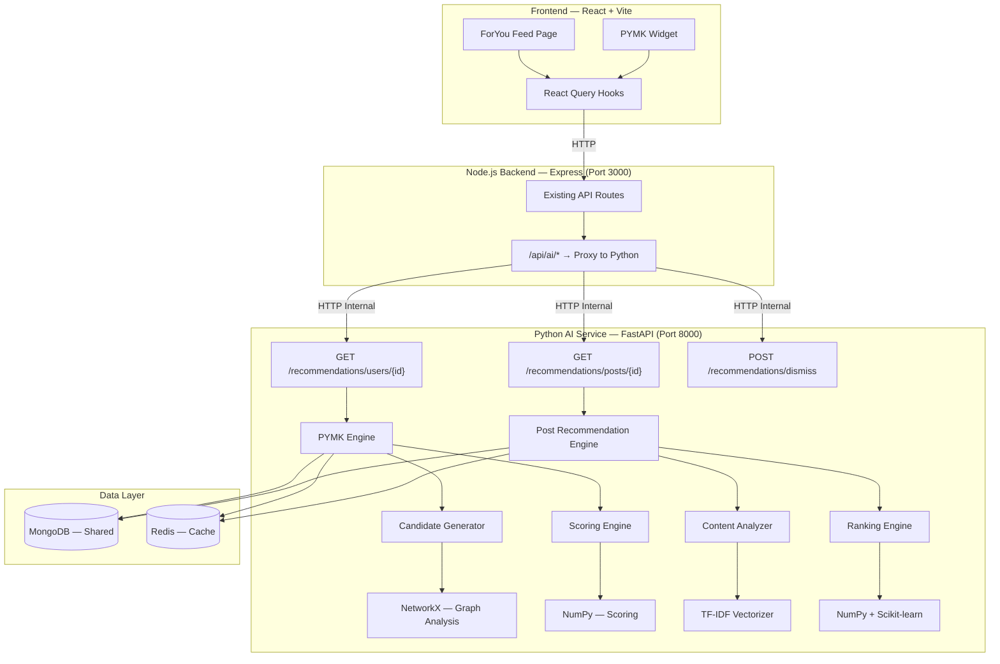
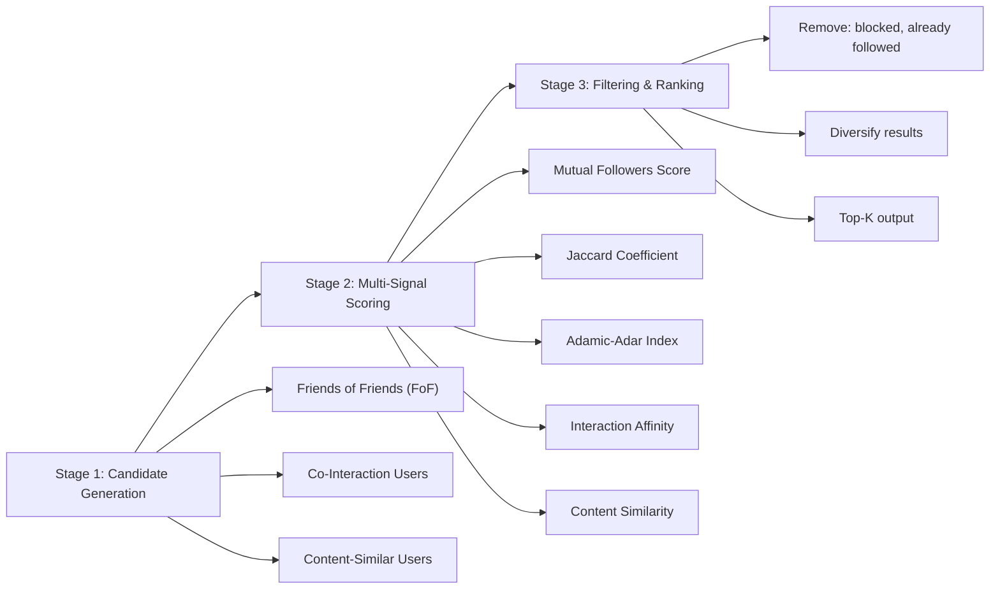
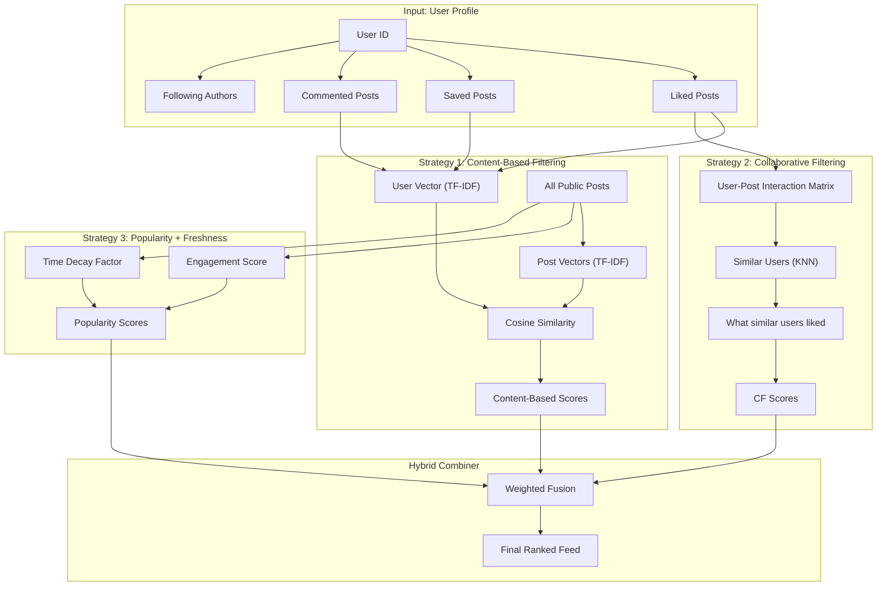
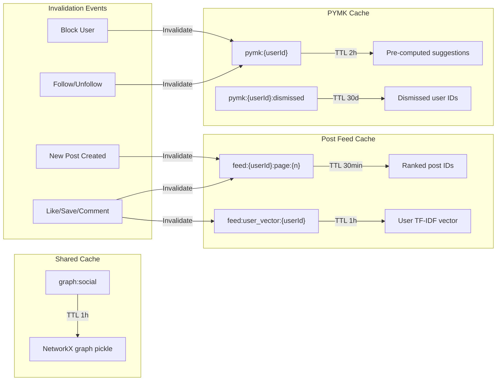

# Trendify AI Recommendation Engine — Implementation Plan

## 1. Tổng Quan

Xây dựng **AI Recommendation Engine** cho Trendify với 2 module chính:

| Module | Chức năng | Thuật toán chính |
|--------|----------|-----------------|
| 🤝 **PYMK** | Gợi ý người dùng có thể quen biết | Graph-based CF (NetworkX) |
| 📰 **Smart Feed** | Gợi ý bài viết chủ đề tương tự trên ForYou | Hybrid CF + Content-Based |

Cả 2 module chạy trên **Python FastAPI microservice** — tách biệt với Node.js backend hiện tại.

---

## 2. Cách Các Hệ Thống Lớn Triển Khai



> [!NOTE]
> **Pattern chung**: Main API (bất kỳ ngôn ngữ nào) + **Python AI Service tách biệt**. Đây là chuẩn industry vì Python có ecosystem ML/AI tốt nhất thế giới. Trendify sẽ follow đúng pattern này.

---

## 3. Kiến Trúc Tổng Thể



### Communication Flow

```
Frontend → Node.js (auth + proxy) → Python FastAPI → MongoDB/Redis
```

Node.js làm nhiệm vụ:
1. **Authentication** — verify JWT token
2. **Proxy** — forward request đến Python service
3. Giữ nguyên business logic hiện tại

Python service:
1. **Trực tiếp đọc MongoDB** — dùng Motor (async pymongo)
2. **Cache kết quả vào Redis** — tránh tính toán lại
3. **Expose REST API** — FastAPI với auto-gen OpenAPI docs

---

## 4. Module 1: People You May Know (PYMK)

### 4.1 Thuật Toán

Pipeline 3 giai đoạn:



#### Thuật toán chi tiết trong Python:

```python
import networkx as nx
import numpy as np
from sklearn.preprocessing import MinMaxScaler

class PYMKEngine:
    def __init__(self, mongo_db, redis_client):
        self.db = mongo_db
        self.redis = redis_client
    
    async def recommend(self, user_id: str, limit: int = 20):
        # ============ STAGE 1: BUILD GRAPH ============
        # Lấy social graph từ MongoDB follows collection
        follows = await self.db.follows.find(
            {"status": "ACCEPTED"}
        ).to_list(None)
        
        G = nx.DiGraph()
        for f in follows:
            G.add_edge(str(f["followerId"]), str(f["followingId"]))
        
        # ============ STAGE 2: CANDIDATE GENERATION ============
        # Friends of Friends (2-hop neighbors)
        following = set(G.successors(user_id))
        candidates = {}
        
        for friend in following:
            for fof in G.successors(friend):
                if fof != user_id and fof not in following:
                    if fof not in candidates:
                        candidates[fof] = {"mutual_through": []}
                    candidates[fof]["mutual_through"].append(friend)
        
        # ============ STAGE 3: MULTI-SIGNAL SCORING ============
        scored = []
        candidate_pairs = [(user_id, c) for c in candidates.keys()]
        
        # Signal 1: Jaccard Coefficient (NetworkX built-in)
        jaccard = dict(
            ((u, v), j) for u, v, j 
            in nx.jaccard_coefficient(G.to_undirected(), candidate_pairs)
        )
        
        # Signal 2: Adamic-Adar Index (weights by node popularity)
        adamic_adar = dict(
            ((u, v), aa) for u, v, aa 
            in nx.adamic_adar_index(G.to_undirected(), candidate_pairs)
        )
        
        for candidate_id, meta in candidates.items():
            mutual_count = len(meta["mutual_through"])
            jc = jaccard.get((user_id, candidate_id), 0)
            aa = adamic_adar.get((user_id, candidate_id), 0)
            
            # Signal 3: Interaction affinity (co-likes)
            interaction = await self._interaction_affinity(user_id, candidate_id)
            
            # Signal 4: Content similarity (shared hashtags)  
            content_sim = await self._content_similarity(user_id, candidate_id)
            
            # Weighted combination
            score = (
                0.30 * self._normalize(mutual_count, max_mutual) +
                0.25 * jc +
                0.20 * self._normalize(aa, max_aa) +
                0.15 * interaction +
                0.10 * content_sim
            )
            
            scored.append({
                "userId": candidate_id,
                "score": score,
                "mutualCount": mutual_count,
                "mutualUsers": meta["mutual_through"][:3],
                "source": "fof"
            })
        
        # ============ STAGE 4: FILTER & RANK ============
        blocked = await self._get_blocked_ids(user_id)
        dismissed = await self._get_dismissed_ids(user_id)
        
        results = [
            s for s in scored 
            if s["userId"] not in blocked 
            and s["userId"] not in dismissed
        ]
        results.sort(key=lambda x: x["score"], reverse=True)
        
        return results[:limit]
```

### 4.2 So sánh thuật toán (cho đồ án trình bày)

| Metric | Giải thích | Công thức |
|--------|-----------|-----------|
| **Mutual Followers** | Đếm bạn chung | `|N(u) ∩ N(v)|` |
| **Jaccard Coefficient** | Tương đồng mạng lưới, chuẩn hóa | `|N(u) ∩ N(v)| / |N(u) ∪ N(v)|` |
| **Adamic-Adar Index** | Như Jaccard nhưng giảm weight cho popular nodes | `Σ 1/log(|N(w)|)` cho `w ∈ N(u) ∩ N(v)` |
| **Interaction Affinity** | Hành vi tương tác giống nhau | Co-likes / Total likes |
| **Content Similarity** | Sở thích nội dung | Shared hashtags ratio |

---

## 5. Module 2: Smart Post Recommendation (ForYou Feed)

> [!IMPORTANT]
> Hiện tại trang **ForYou đang dùng fake data** (`fakeGetPosts`). Module này sẽ thay thế bằng AI-powered personalized feed.

### 5.1 Thuật Toán

Hybrid approach kết hợp 3 chiến lược:



#### Thuật toán chi tiết:

```python
from sklearn.feature_extraction.text import TfidfVectorizer
from sklearn.metrics.pairwise import cosine_similarity
from sklearn.neighbors import NearestNeighbors
import numpy as np
from datetime import datetime, timedelta

class PostRecommendationEngine:
    
    async def recommend(self, user_id: str, limit: int = 20, cursor: str = None):
        
        # ============ BUILD USER PROFILE ============
        # Lấy posts mà user đã tương tác
        liked_post_ids = await self._get_liked_posts(user_id)
        saved_post_ids = await self._get_saved_posts(user_id)
        commented_post_ids = await self._get_commented_posts(user_id)
        following_ids = await self._get_following_ids(user_id)
        
        interacted_ids = set(liked_post_ids + saved_post_ids + commented_post_ids)
        
        # ============ STRATEGY 1: CONTENT-BASED ============
        # Xây dựng "user taste profile" từ content đã tương tác
        interacted_posts = await self.db.posts.find(
            {"_id": {"$in": list(interacted_ids)}}
        ).to_list(None)
        
        # Combine text: content + hashtags
        user_text = " ".join([
            self._post_to_text(p) for p in interacted_posts
        ])
        
        # Lấy candidate posts (public, chưa tương tác, 7 ngày gần)
        candidate_posts = await self.db.posts.find({
            "status": "active",
            "settings.visibility": "public",
            "_id": {"$nin": list(interacted_ids)},
            "createdAt": {"$gte": datetime.now() - timedelta(days=7)},
            "replyToId": None,  # Không lấy replies
        }).to_list(500)  # Limit candidates
        
        if not candidate_posts:
            return {"posts": [], "nextCursor": None}
        
        # TF-IDF Vectorization
        corpus = [user_text] + [self._post_to_text(p) for p in candidate_posts]
        tfidf = TfidfVectorizer(max_features=1000, stop_words=None)
        vectors = tfidf.fit_transform(corpus)
        
        # Cosine similarity giữa user profile và mỗi candidate
        user_vec = vectors[0:1]
        post_vecs = vectors[1:]
        content_scores = cosine_similarity(user_vec, post_vecs).flatten()
        
        # ============ STRATEGY 2: COLLABORATIVE FILTERING ============
        # Tìm users có hành vi tương tác giống
        cf_scores = await self._collaborative_scores(
            user_id, candidate_posts, interacted_ids
        )
        
        # ============ STRATEGY 3: POPULARITY + FRESHNESS ============
        pop_scores = []
        for post in candidate_posts:
            counters = post.get("counters", {})
            engagement = (
                counters.get("likeCount", 0) * 1.0 +
                counters.get("commentCount", 0) * 2.0 +
                counters.get("saveCount", 0) * 3.0 +
                counters.get("shareCount", 0) * 2.5
            )
            
            # Time decay: posts mới hơn được ưu tiên
            age_hours = (datetime.now() - post["createdAt"]).total_seconds() / 3600
            freshness = 1.0 / (1.0 + age_hours / 24.0)  # Decay over days
            
            pop_scores.append(engagement * freshness)
        
        # Normalize tất cả scores
        pop_scores = self._min_max_normalize(np.array(pop_scores))
        content_scores = self._min_max_normalize(content_scores)
        cf_scores = self._min_max_normalize(np.array(cf_scores))
        
        # ============ HYBRID FUSION ============
        # Nếu user mới (ít tương tác) → tăng weight popularity
        interaction_count = len(interacted_ids)
        
        if interaction_count < 5:  # Cold start
            weights = {"content": 0.1, "cf": 0.1, "popularity": 0.8}
        elif interaction_count < 20:
            weights = {"content": 0.3, "cf": 0.2, "popularity": 0.5}
        else:
            weights = {"content": 0.4, "cf": 0.35, "popularity": 0.25}
        
        final_scores = (
            weights["content"] * content_scores +
            weights["cf"] * cf_scores +
            weights["popularity"] * pop_scores
        )
        
        # ============ FOLLOWING BOOST ============
        # Boost posts từ authors mà user follow (nhưng không quá dominate)
        following_set = set(following_ids)
        for i, post in enumerate(candidate_posts):
            if str(post["authorId"]) in following_set:
                final_scores[i] *= 1.3  # 30% boost
        
        # Sort + paginate
        ranked_indices = np.argsort(-final_scores)
        
        return {
            "postIds": [str(candidate_posts[i]["_id"]) for i in ranked_indices[:limit]],
            "scores": [float(final_scores[i]) for i in ranked_indices[:limit]],
            "nextCursor": ...,
            "meta": {
                "strategy": weights,
                "candidateCount": len(candidate_posts),
                "userInteractions": interaction_count
            }
        }
    
    def _post_to_text(self, post) -> str:
        """Combine content + hashtags thành text cho TF-IDF"""
        parts = []
        if post.get("content"):
            parts.append(post["content"])
        for ht in post.get("hashtags", []):
            parts.append(ht["tag"])
        return " ".join(parts)
    
    async def _collaborative_scores(self, user_id, candidates, interacted_ids):
        """Tìm similar users → xem họ thích gì"""
        # Build interaction matrix (sparse)
        all_likes = await self.db.likes.find({}).to_list(None)
        
        # ... KNN-based approach
        # Tìm K users có tập like overlap nhiều nhất
        # Score = how many similar users liked this candidate post
```

### 5.2 Cold Start Problem

Khi user mới chưa có tương tác:

| User Status | Chiến lược |
|------------|-----------|
| **0 interactions** | 100% Popularity-based (trending posts) |
| **1-5 interactions** | 80% Popularity + 10% Content + 10% CF |
| **5-20 interactions** | 50% Popularity + 30% Content + 20% CF |
| **20+ interactions** | 25% Popularity + 40% Content + 35% CF |

→ Hệ thống **tự động điều chỉnh weights** theo mức độ engagement của user — đây là điểm hay để trình bày trong đồ án.

---

## 6. Project Structure — `trendify-ai/`

```
trendify-ai/
├── app/
│   ├── __init__.py
│   ├── main.py                          # FastAPI entry point
│   ├── config.py                        # MongoDB, Redis, env configs
│   │
│   ├── routers/
│   │   ├── __init__.py
│   │   ├── user_recommendations.py      # PYMK endpoints
│   │   └── post_recommendations.py      # Post feed endpoints
│   │
│   ├── engines/
│   │   ├── __init__.py
│   │   ├── pymk_engine.py              # People You May Know
│   │   │   ├── candidate_generator.py   # Stage 1: FoF, co-interaction
│   │   │   ├── scoring_engine.py        # Stage 2: Multi-signal scoring
│   │   │   └── filter_engine.py         # Stage 3: Block/dismiss filter
│   │   │
│   │   └── post_engine.py              # Post Recommendation
│   │       ├── content_analyzer.py      # TF-IDF, text processing
│   │       ├── collaborative_filter.py  # User-User CF
│   │       ├── popularity_scorer.py     # Engagement + freshness
│   │       └── hybrid_ranker.py         # Weighted fusion
│   │
│   ├── models/                          # Pydantic response models
│   │   ├── __init__.py
│   │   ├── user_suggestion.py
│   │   └── post_recommendation.py
│   │
│   ├── services/
│   │   ├── __init__.py
│   │   ├── mongo_service.py             # Motor async client
│   │   ├── redis_service.py             # aioredis cache
│   │   └── graph_service.py             # NetworkX graph builder
│   │
│   └── utils/
│       ├── __init__.py
│       ├── normalization.py             # Min-max, z-score normalizers
│       └── text_processing.py           # Vietnamese text utils
│
├── tests/
│   ├── test_pymk_engine.py
│   └── test_post_engine.py
│
├── requirements.txt
├── Dockerfile
└── README.md
```

### `requirements.txt`

```
fastapi==0.115.0
uvicorn==0.30.0
motor==3.5.0            # Async MongoDB driver
aioredis==2.0.1         # Async Redis
networkx==3.3           # Graph analysis
numpy==2.0.0            # Numerical computing
scikit-learn==1.5.0     # TF-IDF, KNN, cosine similarity
pydantic==2.8.0         # Data validation
python-dotenv==1.0.0    # Environment variables
```

---

## 7. API Contracts

### Node.js ↔ Python Communication

#### PYMK - Gợi ý bạn bè

```http
GET http://localhost:8000/api/recommendations/users/{user_id}?limit=20

Response 200:
{
  "suggestions": [
    {
      "userId": "6614a...",
      "score": 0.87,
      "mutualCount": 12,
      "mutualUsers": ["6614b...", "6614c...", "6614d..."],
      "source": "friends_of_friends",
      "explanation": "12 người theo dõi chung"
    }
  ],
  "meta": {
    "totalCandidates": 156,
    "algorithm": "graph_hybrid_cf",
    "computeTimeMs": 234
  }
}
```

#### Post Recommendation - Gợi ý bài viết

```http
GET http://localhost:8000/api/recommendations/posts/{user_id}?limit=20&cursor=xxx

Response 200:
{
  "postIds": ["post_id_1", "post_id_2", ...],
  "scores": [0.92, 0.88, ...],
  "nextCursor": "...",
  "meta": {
    "strategy": { "content": 0.4, "cf": 0.35, "popularity": 0.25 },
    "candidateCount": 500,
    "userInteractions": 45,
    "coldStart": false
  }
}
```

#### Dismiss Suggestion

```http
POST http://localhost:8000/api/recommendations/dismiss
Body: { "userId": "...", "targetId": "...", "type": "user" | "post" }
```

### Node.js Proxy Setup

```typescript
// trendify-backed/src/interfaces/routes/ai.route.ts
import { Router } from "express";
import axios from "axios";
import { authMiddleware } from "../middlewares";

const AI_SERVICE_URL = process.env.AI_SERVICE_URL || "http://localhost:8000";
const router = Router();

// Proxy ALL /api/ai/* requests to Python service
router.use("/ai", authMiddleware, async (req, res) => {
  try {
    const userId = res.locals.auth.userId;
    const pythonUrl = `${AI_SERVICE_URL}/api/recommendations${req.path}`;
    
    const response = await axios({
      method: req.method,
      url: pythonUrl,
      params: { ...req.query, userId },
      data: req.body,
      timeout: 5000,
    });
    
    res.json(response.data);
  } catch (error) {
    // Fallback: return empty suggestions if AI service is down
    res.json({ suggestions: [], postIds: [], meta: { fallback: true } });
  }
});
```

---

## 8. Proposed Changes — Full File List

### New Project: `trendify-ai/` (Python FastAPI)

| File | Mô tả |
|------|-------|
| [NEW] `app/main.py` | FastAPI app, CORS, lifespan events |
| [NEW] `app/config.py` | MongoDB URI, Redis, env vars |
| [NEW] `app/routers/user_recommendations.py` | PYMK API endpoints |
| [NEW] `app/routers/post_recommendations.py` | Post recommendation endpoints |
| [NEW] `app/engines/pymk_engine.py` | Full PYMK pipeline |
| [NEW] `app/engines/post_engine.py` | Full Post recommendation pipeline |
| [NEW] `app/services/mongo_service.py` | Motor async MongoDB |
| [NEW] `app/services/redis_service.py` | aioredis caching |
| [NEW] `app/services/graph_service.py` | NetworkX graph builder |
| [NEW] `app/models/` | Pydantic schemas |
| [NEW] `requirements.txt` | Dependencies |

### Backend: `trendify-backed/` (Node.js — Minimal changes)

| File | Mô tả |
|------|-------|
| [NEW] `src/interfaces/routes/ai.route.ts` | Proxy route → Python service |
| [MODIFY] `src/interfaces/routes/index.ts` | Register AI route |
| [MODIFY] `.env` | Add `AI_SERVICE_URL=http://localhost:8000` |

### Frontend: `trendify-portal/` (React)

| File | Mô tả |
|------|-------|
| [NEW] `src/hooks/useSuggestions.ts` | React Query hook for PYMK |
| [NEW] `src/hooks/useForYouFeed.ts` | React Query hook for AI-powered feed |
| [NEW] `src/pages/home/components/SuggestionCard.tsx` | Single suggestion card |
| [NEW] `src/pages/home/components/SuggestionWidget.tsx` | PYMK widget container |
| [MODIFY] `src/pages/home/components/ForyouPage.tsx` | Replace `fakeGetPosts` → real AI feed |
| [MODIFY] `src/pages/home/Home.tsx` | Integrate SuggestionWidget |

---

## 9. Caching Strategy



---

## 10. Kế Hoạch Thực Thi

### Phase 1: Python Service Foundation (1-2 ngày)
- [ ] Initialize `trendify-ai/` với FastAPI
- [ ] Setup Motor (MongoDB) + aioredis connections  
- [ ] Health check endpoint
- [ ] Test connectivity to existing MongoDB

### Phase 2: PYMK Engine (2-3 ngày)
- [ ] Graph builder service (NetworkX từ follows)
- [ ] Friends-of-Friends candidate generation
- [ ] Multi-signal scoring (Jaccard, Adamic-Adar, mutual count)
- [ ] Interaction affinity scoring
- [ ] Content similarity scoring
- [ ] Filter engine (blocks, dismissed)
- [ ] Redis caching
- [ ] API endpoint: `GET /recommendations/users/{id}`

### Phase 3: Post Recommendation Engine (2-3 ngày)
- [ ] User profile builder (from likes/saves/comments)
- [ ] TF-IDF content analyzer
- [ ] Cosine similarity matching
- [ ] Collaborative filtering (KNN-based)
- [ ] Popularity + freshness scoring
- [ ] Hybrid weighted fusion with cold-start handling
- [ ] API endpoint: `GET /recommendations/posts/{id}`

### Phase 4: Node.js Integration (1 ngày)
- [ ] Proxy route `/api/ai/*` → Python service
- [ ] Fallback handling khi Python service down
- [ ] Environment configuration

### Phase 5: Frontend Integration (2-3 ngày)
- [ ] `useForYouFeed` hook → replace `fakeGetPosts`
- [ ] ForYou page renders real AI-recommended posts
- [ ] `useSuggestions` hook
- [ ] SuggestionCard + SuggestionWidget components
- [ ] Integrate widgets into Home page
- [ ] Dismiss mutation + optimistic UI
- [ ] Loading states, error handling

### Phase 6: Polish & Demo (1 ngày)
- [ ] Seed test data (nếu cần)
- [ ] Tune weights cho cả 2 module
- [ ] Performance optimization
- [ ] Demo recording

**Tổng thời gian ước tính: ~8-12 ngày**

---

## 11. Ý Tưởng Trình Bày Đồ Án

### Slide gợi ý:

1. **Problem Statement**: "Làm sao gợi ý nội dung và người dùng phù hợp trong mạng xã hội?"
2. **Solution Overview**: Kiến trúc microservice — tách biệt AI service bằng Python
3. **Algorithm Deep-Dive**:
   - PYMK: Graph-based CF với NetworkX (Jaccard, Adamic-Adar)
   - Post Feed: Hybrid CF + Content-Based (TF-IDF, Cosine Similarity, KNN)
   - Cold Start handling — adaptive weights
4. **System Architecture**: Diagram microservice Node.js ↔ Python ↔ MongoDB
5. **Demo**: Live demo ForYou feed + PYMK widget
6. **Evaluation**: So sánh kết quả trước/sau AI (precision, diversity)

### Thuật ngữ chuyên ngành để dùng:
- **Collaborative Filtering** — lọc cộng tác
- **Content-Based Filtering** — lọc dựa trên nội dung
- **Hybrid Recommender System** — hệ gợi ý lai
- **TF-IDF Vectorization** — vector hóa văn bản
- **Cosine Similarity** — độ tương đồng cosine
- **Cold Start Problem** — vấn đề khởi động lạnh
- **Graph-based Analysis** — phân tích dựa trên đồ thị
- **Jaccard Coefficient / Adamic-Adar Index** — hệ số tương đồng đồ thị

---

## User Review Required

> [!IMPORTANT]
> **Câu hỏi cần trả lời trước khi code:**
>
> 1. **ForYou feed**: Hiện đang dùng fake data. AI feed sẽ **thay thế hoàn toàn** ForYou page hay muốn giữ song song (toggle switch)?
>
> 2. **PYMK Widget vị trí**: Sidebar phải, inline trong feed, hay page riêng?
>
> 3. **Data scale**: Hiện có bao nhiêu users/posts/follows trong database? Cần seed thêm data để demo tốt hơn không?
>
> 4. **Timeline**: Bạn có bao nhiêu thời gian cho feature AI này?
>
> 5. **Python experience**: Bạn có kinh nghiệm với Python/FastAPI không? Hay cần tôi guide chi tiết hơn?

> [!WARNING]
> **Post Recommendation cần đủ data**: Để TF-IDF + CF hoạt động tốt, cần ít nhất:
> - ~50+ users  
> - ~200+ posts (có content/hashtags)
> - ~500+ likes/saves
>
> Nếu database hiện tại chưa đủ, tôi sẽ viết script seed data cho bạn.
