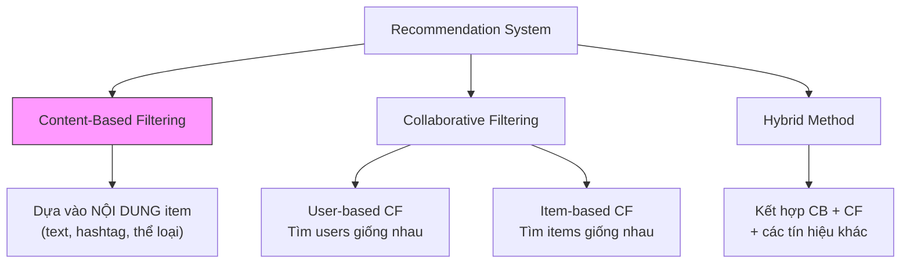
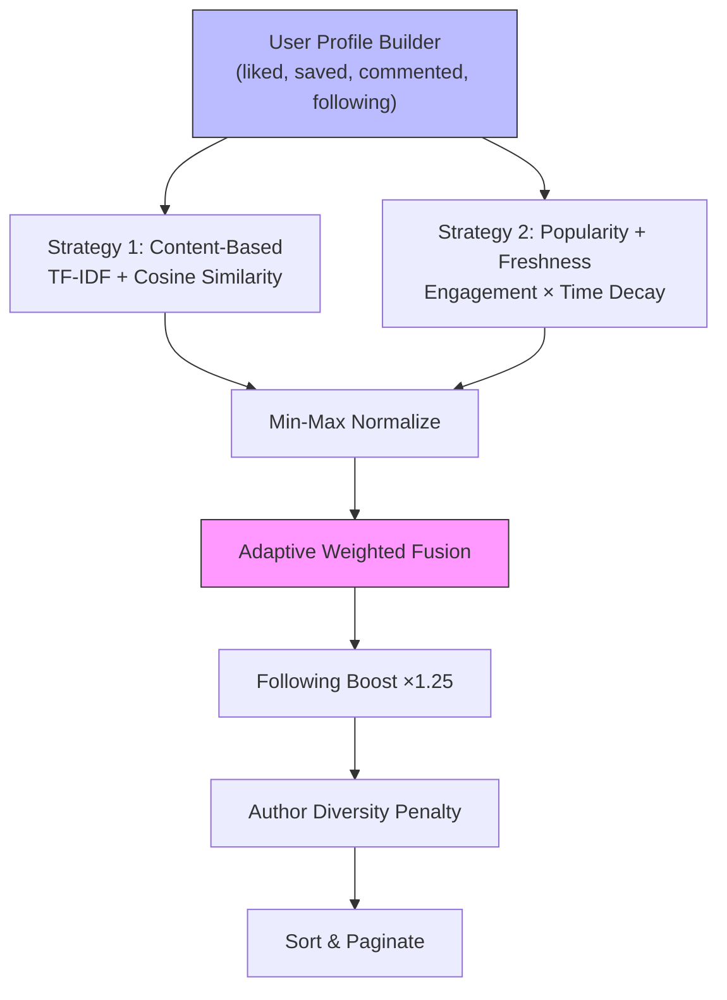
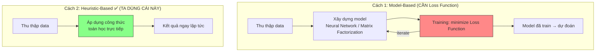
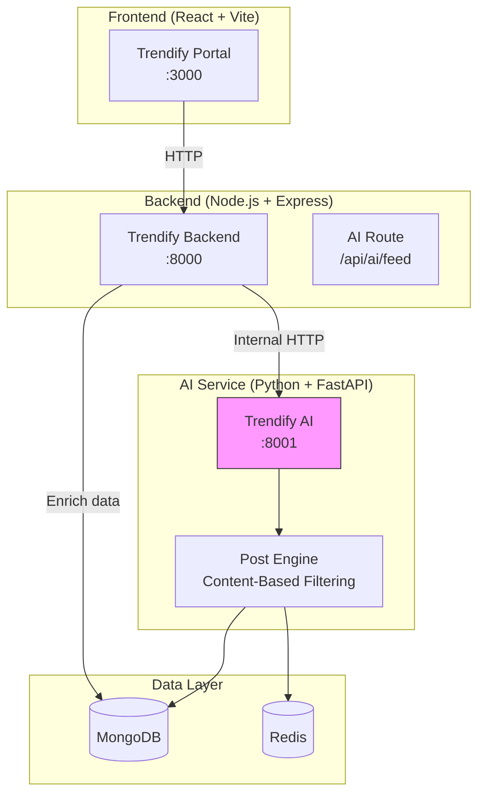

# 🎓 Tài Liệu Bảo Vệ Đồ Án: Hệ Thống Gợi Ý AI — Trendify

> Tài liệu giải thích **từ A đến Z** toàn bộ hệ thống AI Recommendation Engine, dùng để thuyết trình bảo vệ đồ án tốt nghiệp.

---

## Mục Lục
1. [Tổng quan: Recommendation System là gì?](#1-tổng-quan)
2. [Phân loại thuật toán RS và tại sao chọn Content-Based](#2-phân-loại)
3. [Post Engine — Gợi ý bài viết (chi tiết từng bước)](#3-post-engine)
4. [Thư viện sử dụng và vai trò](#4-thư-viện)
5. [Về hàm mất mát (Loss Function) — Khi nào cần, khi nào không](#5-hàm-mất-mát)
6. [Kiến trúc hệ thống & luồng dữ liệu](#6-kiến-trúc)
7. [Câu hỏi bảo vệ thường gặp & cách trả lời](#7-câu-hỏi)

---

# 1. Tổng Quan

## Recommendation System (RS) là gì?

Hệ thống gợi ý (RS) là phần mềm **tự động dự đoán** nội dung hoặc người dùng mà một người sẽ quan tâm, dựa trên dữ liệu hành vi và đặc điểm.

**Ví dụ đời thực:**
- YouTube gợi ý video → RS
- TikTok "ForYou Page" → RS
- Shopee "Gợi ý cho bạn" → RS

## Trong Trendify, ta xây 1 RS:

| Module | Chức năng | Input | Output |
|--------|----------|-------|--------|
| **Post Engine** | Gợi ý bài viết cho "Dành Cho Bạn" | Content + behavior + popularity | Danh sách bài viết xếp hạng |

---

# 2. Phân Loại Thuật Toán RS

## Ba trường phái chính:



### 2.1 Content-Based Filtering (Lọc dựa trên nội dung) — ✅ Ta chọn cái này

**Ý tưởng:** "Nếu bạn thích bài về du lịch → gợi ý thêm bài du lịch"

- Phân tích **nội dung** bài viết (text, hashtags)
- So sánh với **sở thích đã biết** của user
- ✅ Ưu: Không cần data user khác, giải thích được, real-time
- ❌ Nhược: Chỉ gợi ý nội dung tương tự → thiếu đa dạng (giải quyết bằng Popularity + Diversity)

### 2.2 Collaborative Filtering (Lọc cộng tác)

**Ý tưởng:** "Người giống bạn thích gì → bạn cũng sẽ thích"

- Phân tích **hành vi tương tác** (like, comment, save)
- Tìm users có pattern tương tự
- ✅ Ưu: Phát hiện sở thích ẩn, đa dạng
- ❌ Nhược: Cold Start (user mới chưa có data), cần nhiều data

### 2.3 Hybrid (Kết hợp)

Kết hợp nhiều chiến lược, lấy ưu điểm bù nhược điểm.

> [!IMPORTANT]
> **Tại sao chọn Content-Based + Popularity?**
> - Content-Based phân tích **nội dung bài viết** (TF-IDF + Cosine Similarity) → cá nhân hóa dựa trên sở thích
> - Popularity + Freshness đảm bảo bài trending mới không bị bỏ sót
> - Adaptive weights xử lý Cold Start **không cần training model**
> - Phù hợp với quy mô Trendify (không cần hàng triệu users như CF)

---

# 3. Post Engine — Gợi Ý Bài Viết

> File: [engine.py](file:///Users/dophong/Documents/Coding/Trendify/trendify-ai/app/engines/post/engine.py)

## Tổng quan: 2 chiến lược + 2 kỹ thuật bổ sung



---

## Bước 0: Build User Profile

```python
# Song song (asyncio.gather) fetch 4 loại data:
liked     = [post1, post2, ...]   # 300 bài đã like gần đây
saved     = [post5, post6, ...]   # 200 bài đã lưu  
commented = [post8, post9, ...]   # 200 bài đã bình luận
following = [user1, user2, ...]   # Tất cả người đang follow

interacted = liked ∪ saved ∪ commented  # Tất cả bài đã tương tác
interaction_count = |interacted|         # Số lượng → quyết định Adaptive Weights
```

---

## Bước 0.5: Adaptive Weights — Xử lý Cold Start

**Cold Start Problem:** User mới chưa có lịch sử → Content-Based không hoạt động. Giải pháp: **tự động điều chỉnh trọng số** theo số interaction.

```
interactions < 5:  Content 10% | Popularity 90%  ← GẦN NHƯ CHỈ XEM BÀI HOT
interactions < 20: Content 40% | Popularity 60%  ← BẮT ĐẦU CÁ NHÂN HÓA
interactions < 50: Content 60% | Popularity 40%  ← CONTENT CHIẾM ƯU THẾ
interactions ≥ 50: Content 75% | Popularity 25%  ← ƯU TIÊN CÁ NHÂN HÓA SÂU
```

> [!IMPORTANT]
> Đây là cách giải quyết **Cold Start mà KHÔNG cần hàm mất mát**. Ta dùng **luật heuristic** thay vì training model.

---

## Strategy 1: Content-Based Filtering

### Thuật toán: TF-IDF + Cosine Similarity

#### Bước 1: Biến text thành số (TF-IDF Vectorization)

**TF-IDF = Term Frequency × Inverse Document Frequency**

| Thành phần | Công thức | Ý nghĩa |
|-----------|----------|---------|
| **TF** (Term Frequency) | `count(term, doc) / total_terms(doc)` | Từ xuất hiện bao nhiêu lần trong 1 doc |
| **IDF** (Inverse Document Frequency) | `log(N / DF(term))` | Từ càng **hiếm** → IDF càng **cao** |
| **TF-IDF** | `TF × IDF` | Từ vừa **phổ biến trong doc** vừa **hiếm trong corpus** → quan trọng |

**Ví dụ cụ thể:**

```
Corpus (user taste + 4 candidate posts):

Doc 0 (user taste):  "du lịch Đà Nẵng ẩm thực du lịch Hội An"
Doc 1 (candidate A): "du lịch Sài Gòn ẩm thực đường phố"
Doc 2 (candidate B): "lập trình JavaScript React"
Doc 3 (candidate C): "du lịch Hội An cà phê muối"
Doc 4 (candidate D): "bóng đá World Cup 2026"

TF-IDF cho từ "du lịch":
  TF trong doc 0: 2/7 = 0.286  (xuất hiện 2 lần / 7 từ)
  DF = 3 (xuất hiện trong 3/5 docs: doc 0, 1, 3)
  IDF = log(5/3) = 0.511
  TF-IDF = 0.286 × 0.511 = 0.146

TF-IDF cho từ "Hội An":
  TF trong doc 0: 1/7 = 0.143
  DF = 2 (chỉ doc 0 và doc 3)
  IDF = log(5/2) = 0.916  ← HIẾM hơn → IDF cao hơn
  TF-IDF = 0.143 × 0.916 = 0.131
```

**Kết quả:** Mỗi document trở thành 1 **vector số** trong không gian N chiều (N = số từ unique).

**Cấu hình trong code:**
```python
tfidf = TfidfVectorizer(
    max_features=2000,   # Giữ 2000 từ quan trọng nhất → giảm chiều
    ngram_range=(1, 2),  # Xét cả unigram ("du lịch") và bigram ("du lịch Đà Nẵng")
    min_df=1,            # Từ phải xuất hiện ít nhất 1 lần
)
vectors = tfidf.fit_transform(corpus)  # Sparse matrix
```

**Thư viện:** `sklearn.feature_extraction.text.TfidfVectorizer` từ **scikit-learn**

---

#### Bước 2: So sánh bằng Cosine Similarity

**Sau TF-IDF:** user profile = 1 vector, mỗi candidate = 1 vector. So sánh bằng **góc** giữa chúng.

**Công thức:**

```
                A⃗ · B⃗           Σ(Aᵢ × Bᵢ)
cos(θ) = ──────────────── = ─────────────────────
            |A⃗| × |B⃗|       √Σ(Aᵢ²) × √Σ(Bᵢ²)
```

**Ví dụ đơn giản (2 chiều):**
```
user_vec   = [0.8, 0.3]   ("du lịch" nặng, "lập trình" nhẹ)
post_A_vec = [0.7, 0.2]   ("du lịch" nặng)
post_B_vec = [0.1, 0.9]   ("lập trình" nặng)

cos(user, A) = (0.8×0.7 + 0.3×0.2) / (√(0.64+0.09) × √(0.49+0.04))
             = 0.62 / (0.854 × 0.728)
             = 0.62 / 0.622 = 0.997  ← RẤT GIỐNG!

cos(user, B) = (0.8×0.1 + 0.3×0.9) / (0.854 × √(0.01+0.81))
             = 0.35 / (0.854 × 0.906)
             = 0.35 / 0.774 = 0.452  ← KHÁC NHIỀU
```

**Kết quả:**
- Post A (du lịch) → 0.997 → rất phù hợp ✅
- Post B (lập trình) → 0.452 → ít phù hợp ❌

**Thư viện:** `sklearn.metrics.pairwise.cosine_similarity`

---

## Strategy 2: Popularity + Freshness

### Engagement Score — "Bài này hot thế nào?"

```python
engagement = (
    likeCount    × 1.0   # Like = tín hiệu cơ bản
  + commentCount × 2.0   # Comment = tích cực hơn
  + saveCount    × 3.0   # Save = giá trị nhất (muốn xem lại)
  + shareCount   × 2.5   # Share = lan truyền
  + viewCount    × 0.1   # View = thụ động, ít giá trị
)
```

### Time Decay — "Bài cũ giảm điểm"

**Exponential Decay Function:**

```
freshness(t) = e^(-0.693 × t / T½)

t   = tuổi bài (giờ)
T½  = half-life = 72 giờ (3 ngày)
0.693 = ln(2) ← để đảm bảo sau đúng T½ giờ, giá trị giảm còn 50%
```

**Bảng giá trị:**
```
Vừa đăng (0h):    freshness = 1.000  (100%)
Sau 1 ngày (24h):  freshness = 0.794  (79%)
Sau 3 ngày (72h):  freshness = 0.500  (50%)  ← half-life
Sau 1 tuần (168h): freshness = 0.198  (20%)
Sau 2 tuần (336h): freshness = 0.039  (4%)
```

**Kết hợp:** `popularity_score = engagement × freshness`

→ Bài mới 1 ngày, 100 engagement: 100 × 0.794 = **79.4**
→ Bài cũ 1 tuần, 500 engagement: 500 × 0.198 = **99.0**
→ Bài cũ vẫn thắng nếu engagement đủ cao, nhưng không áp đảo mãi.

---

## 2 Kỹ thuật bổ sung:

### Following Boost (+25%)

```python
if post.author_id in following_set:
    final_score *= 1.25  # Boost 25%
```
Bài từ người mình follow được ưu tiên hơn, nhưng KHÔNG chi phối 100% feed.

### Author Diversity (Phạt -70% sau 3 bài)

```python
max_per_author = 3
# Bài thứ 4+ từ cùng tác giả:
final_score *= 0.3  # Giảm 70% → đẩy xuống cuối
```
Tránh 1 tác giả chiếm hết feed → đa dạng nội dung.

---

# 4. Thư Viện Sử Dụng

| Thư viện | Version | Vai trò | Dùng ở đâu |
|---------|---------|---------|-----------| 
| **FastAPI** | 0.115.12 | Web framework | API endpoints, lifespan, validation |
| **Uvicorn** | 0.34.3 | ASGI server | Chạy FastAPI (async) |
| **Motor** | 3.7.1 | Async MongoDB driver | Đọc users, posts, likes, follows |
| **Redis (aioredis)** | 5.3.0 | Async Redis client | Cache kết quả |
| **NumPy** | 2.2.5 | Numerical computing | Normalization, array operations, argsort |
| **scikit-learn** | 1.6.1 | ML library | TF-IDF Vectorizer, Cosine Similarity |
| **Pydantic** | 2.11.3 | Data validation | Request/Response schemas |
| **python-dotenv** | 1.1.0 | Config management | Load .env file |

### Chi tiết thư viện chính:

**scikit-learn** — Thư viện ML, ta dùng module feature_extraction
```python
from sklearn.feature_extraction.text import TfidfVectorizer
from sklearn.metrics.pairwise import cosine_similarity

tfidf = TfidfVectorizer(max_features=2000)
vectors = tfidf.fit_transform(corpus)        # Text → TF-IDF vectors
sim = cosine_similarity(user_vec, post_vecs)  # Tính similarity
```

---

# 5. Về Hàm Mất Mát (Loss Function)

> [!CAUTION]
> **Câu hỏi quan trọng:** "Tại sao hệ thống của em không dùng hàm mất mát?"

## Trả lời: Hệ thống này **KHÔNG dùng Loss Function** vì **KHÔNG training model**

### Phân biệt 2 cách tiếp cận:



### Khi nào CẦN Loss Function?

| Phương pháp | Loss Function | Ví dụ |
|-------------|--------------|-------|
| Matrix Factorization (SVD) | MSE: `L = Σ(r_ui - r̂_ui)²` | Netflix Prize |
| Neural CF (Deep Learning) | Binary Cross-Entropy | YouTube, TikTok |
| Embedding Learning | BPR Loss, Triplet Loss | Pinterest, Spotify |

→ Các phương pháp này **train model trên tập training** → cần loss function để đo "model dự đoán sai bao nhiêu" → tối ưu (gradient descent).

### Khi nào KHÔNG cần?

| Phương pháp | Tại sao không cần | Ví dụ |
|-------------|-------------------|-------|
| **TF-IDF + Cosine** | Biến đổi thống kê, không training | ✅ Ta dùng |
| **Popularity scoring** | Công thức heuristic tĩnh | ✅ Ta dùng |
| **Min-Max Normalization** | Phép biến đổi tuyến tính | ✅ Ta dùng |

### Tóm lại:

> **Hệ thống Trendify dùng phương pháp Heuristic-Based Recommendation:**
> - Không training model → không cần loss function
> - Dùng công thức toán học được chứng minh (TF-IDF, Cosine Similarity)
> - Kết hợp bằng Weighted Linear Combination với trọng số adaptive
> - Ưu điểm: nhanh, dễ hiểu, không cần GPU, real-time
> - Nhược điểm: kém chính xác hơn Deep Learning nếu data rất lớn (>100M users)

### Nếu muốn nâng cấp lên model-based (tham khảo, KHÔNG cần làm):

```
Bước 1: Thu thập implicit feedback (like=1, skip=0)
Bước 2: Xây model (VD: Matrix Factorization)
         - User matrix U (m × k)
         - Item matrix V (n × k)
         - Dự đoán: r̂ = U × Vᵀ
Bước 3: Loss function: L = Σ(rui - ûᵢ·v̂ⱼ)² + λ(||U||² + ||V||²)
         - MSE + L2 Regularization
Bước 4: Optimize bằng SGD (Stochastic Gradient Descent)
Bước 5: Repeat cho đến khi Loss hội tụ
```

---

# 6. Kiến Trúc Hệ Thống



**Luồng dữ liệu khi user vào trang ForYou:**

```
1. FE gửi GET /api/ai/feed (kèm accessToken)
2. BE (ai.route.ts) xác thực token → lấy userId
3. BE gọi AI Service: GET :8001/api/recommendations/posts/{userId}
4. AI Service:
   a. Check Redis cache → nếu có → trả luôn
   b. Build user profile (liked, saved, commented, following)
   c. Fetch 500 candidate posts từ MongoDB
   d. Tính Content scores (TF-IDF + Cosine Similarity)
   e. Tính Popularity scores (engagement × time decay)
   f. Normalize + Adaptive Weighted Fusion
   g. Following Boost + Author Diversity
   h. Cache kết quả vào Redis (30 phút)
   i. Trả {postIds, scores, nextCursor}
5. BE nhận postIds → truy vấn MongoDB lấy full post data
6. BE enriches: author info, media URLs, viewer context
7. BE trả JSON hoàn chỉnh cho FE
8. FE render danh sách bài viết
```

---

# 7. Câu Hỏi Bảo Vệ Thường Gặp

### Q1: "Tại sao chọn Content-Based Filtering thay vì Collaborative Filtering?"
> **A:** CF thuần túy có **Cold Start Problem** — user mới chưa có interaction history, hệ thống không thể gợi ý. Content-Based phân tích **nội dung bài viết** nên có thể hoạt động ngay khi user chỉ tương tác vài bài. Kết hợp với Popularity scoring cho user mới (adaptive weights), hệ thống xử lý được mọi trường hợp mà không cần lượng data lớn như CF yêu cầu.

### Q2: "TF-IDF có hạn chế gì?"
> **A:** TF-IDF không hiểu ngữ nghĩa — "ẩm thực" và "món ăn" là 2 từ hoàn toàn khác biệt dù cùng nghĩa. Để cải thiện, có thể dùng **Word Embedding** (Word2Vec, BERT) nhưng sẽ tốn tài nguyên hơn nhiều. Với quy mô Trendify, TF-IDF là đủ tốt và rất nhanh.

### Q3: "Trọng số weight lấy từ đâu? Có cơ sở không?"
> **A:** Trọng số adaptive dựa trên nguyên tắc: user mới chưa có data → dựa vào bài hot (popularity), user nhiều interaction → TF-IDF có đủ data để cá nhân hóa chính xác. Các ngưỡng (5, 20, 50 interactions) dựa trên thực nghiệm. Trong production, có thể tune bằng **A/B testing** hoặc **offline evaluation** bằng Precision@K.

### Q4: "Tại sao không dùng Deep Learning?"
> **A:** 
> 1. **Data chưa đủ lớn** — DL cần hàng triệu interactions để hiệu quả
> 2. **Tài nguyên hạn chế** — DL cần GPU, inference chậm hơn
> 3. **Heuristic đủ tốt** — TF-IDF + Cosine Similarity đã được chứng minh hiệu quả cho text similarity
> 4. **Interpretability** — Ta giải thích được TẠI SAO gợi ý (VD: cosine similarity cao vì cùng chủ đề "du lịch"), DL là black box

### Q5: "Cosine Similarity tại sao tốt hơn Euclidean Distance?"
> **A:** Cosine đo **hướng** (direction) của vector, không quan tâm **độ dài** (magnitude). Trong text analysis, 2 bài viết cùng chủ đề nhưng 1 bài dài gấp đôi → Euclidean khoảng cách xa, nhưng Cosine vẫn cao. Cosine phù hợp hơn cho sparse, high-dimensional data như TF-IDF vectors.

### Q6: "Hệ thống scale thế nào khi user tăng?"
> **A:**
> - **Redis caching** giảm 90% computation (TTL 30 phút)
> - **Pagination** không load toàn bộ 1 lần
> - **Candidate limit** chỉ xét 500 posts gần nhất (14 ngày)
> - Nếu >1M posts → có thể dùng **FAISS** (Facebook AI Similarity Search) cho vector search nhanh hơn

### Q7: "Em có đánh giá hệ thống không? Metrics nào?"
> **A:** Có thể đánh giá bằng:
> - **Precision@K**: Trong top K gợi ý, bao nhiêu % user thực sự interact
> - **NDCG**: Đánh giá thứ hạng — bài tốt có ở đầu danh sách không
> - **Coverage**: Hệ thống gợi ý bao nhiêu % tổng items (tránh chỉ gợi ý bài hot)
> - **A/B test**: So sánh engagement (CTR, time-on-feed) giữa random feed vs AI feed

### Q8: "Tại sao tách Python service riêng thay vì viết trong Node.js?"
> **A:** Python có **ecosystem ML/AI tốt nhất thế giới** — scikit-learn, NumPy, TF-IDF vectorizer đều native Python. Node.js không có thư viện ML tương đương. Đây là **pattern chuẩn industry** — Facebook dùng PHP + Python ML, TikTok dùng Go + Python ML. Tách service cũng cho phép scale độc lập và deploy riêng.

---

> [!TIP]
> **Khi thuyết trình:** Hãy vẽ sơ đồ pipeline (Build Profile → TF-IDF → Cosine Similarity → Weighted Fusion → Ranked Feed) lên bảng, viết công thức TF-IDF và Cosine, và tính 1 ví dụ tay. Hội đồng sẽ ấn tượng khi bạn hiểu rõ toán hơn là chỉ demo code.
