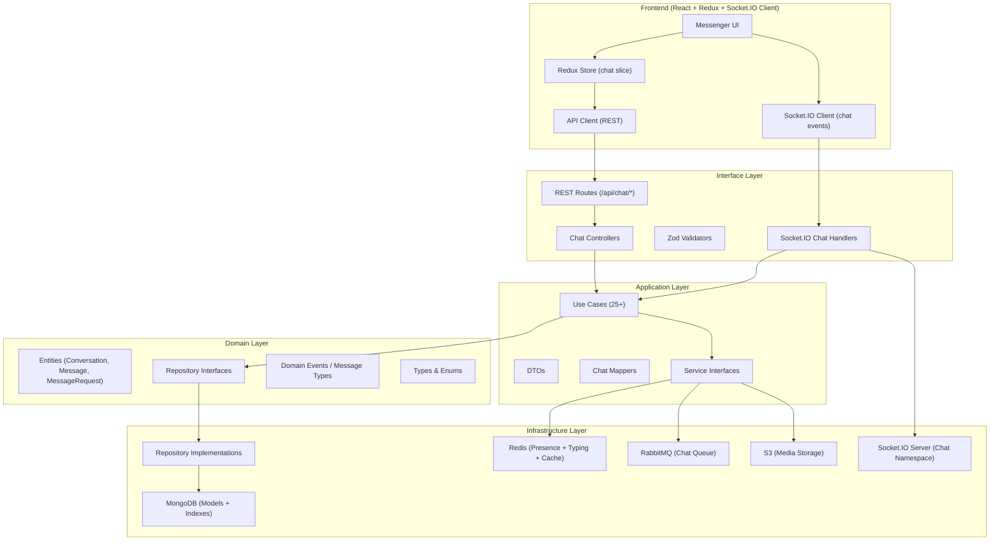

# 🏗️ Production-Grade Chat System — Implementation Plan

Hệ thống chat hoàn chỉnh cho Trendify, tuân thủ Clean Architecture hiện có, sẵn sàng deploy với hàng nghìn concurrent users.

---

## User Review Required

> [!IMPORTANT]
> **Message Queue Decision**: Codebase hiện tại đang dùng **RabbitMQ** (amqplib). Yêu cầu của bạn ghi BullMQ + Redis. Có 2 lựa chọn:
> - **Option A**: Tiếp tục dùng RabbitMQ cho consistency với codebase hiện tại, thêm queue mới cho chat
> - **Option B**: Introduce BullMQ + Redis cho chat module (song song với RabbitMQ cho notification/counter)
> 
> **Recommendation**: Option A — dùng RabbitMQ chung vì đã có `BaseConsumer`, `Producer`, `ConnectionManager` pattern sẵn. Tránh thêm message queue thứ 2 gây complexity.

> [!WARNING]
> **Redis Adapter cho Socket.IO**: Hiện tại Socket.IO chưa dùng Redis Adapter. Để scale multi-instance, cần thêm `@socket.io/redis-adapter`. Sẽ implement trong phase Infrastructure.

> [!IMPORTANT]
> **File Storage**: Voice message và media sẽ dùng S3 + presigned URL theo pattern hiện có (`MediaModel` + `S3Service`). Confirm: có muốn thêm GIF/Sticker provider (ví dụ Giphy API) hay chỉ dùng static sticker packs?

> [!IMPORTANT]
> **Frontend Framework**: Messenger page đã có placeholder (`Messenger.tsx`). UI sẽ dùng Ant Design components + custom SCSS theo pattern hiện tại. Confirm layout: split-pane (sidebar conversation list + main chat area) kiểu Facebook Messenger?

---

## Architecture Overview



---

## Phase 1: Domain Layer

Core business entities và interfaces — không phụ thuộc framework nào.

---

### [NEW] `src/domain/chat/conversation.type.ts`

```typescript
// Enums
enum EConversationType { DIRECT = "direct", GROUP = "group" }
enum EConversationRole { MEMBER = "member", ADMIN = "admin", OWNER = "owner" }
enum EMuteUntil { FOREVER = "forever" } // hoặc Date

// Interfaces
interface IConversationMember {
  userId: string;
  role: EConversationRole;
  joinedAt: Date;
  lastReadMessageId?: string;
  lastReadAt?: Date;
  mutedUntil?: Date | EMuteUntil;
  isArchived: boolean;
  isPinned: boolean;
}

interface IConversationProps {
  type: EConversationType;
  members: IConversationMember[];
  name?: string;           // Group name (null for DM)
  avatarMediaId?: string;  // Group avatar
  createdBy: string;
  lastMessage?: {
    messageId: string;
    senderId: string;
    content: string;        // Preview text (truncated)
    type: EMessageType;
    createdAt: Date;
  };
  pinnedMessageIds: string[];
  isDeleted: boolean;
  createdAt: Date;
  updatedAt: Date;
}
```

### [NEW] `src/domain/chat/conversation.entity.ts`

Entity class theo pattern `NotificationEntity`:
- Constructor: `(props, id?)`
- Getters: `data`, `type`, `members`, `lastMessage`, `pinnedMessageIds`
- Domain logic: `addMember()`, `removeMember()`, `promoteAdmin()`, `demoteAdmin()`, `pinMessage()`, `unpinMessage()`, `isMember()`, `isAdmin()`, `isOwner()`, `getMember()`, `canUserSendMessage()`
- Static factory: `createDirect()`, `createGroup()`
- Validation: max 250 members per group, DM chỉ 2 members

### [NEW] `src/domain/chat/message.type.ts`

```typescript
enum EMessageType {
  TEXT = "text", IMAGE = "image", VIDEO = "video", FILE = "file",
  GIF = "gif", STICKER = "sticker", VOICE = "voice",
  SYSTEM = "system"  // "X added Y", "X left the group"
}

enum EMessageStatus { SENT = "sent", DELIVERED = "delivered", SEEN = "seen" }

interface IMessageReaction {
  userId: string;
  emoji: "❤️" | "😆" | "😮" | "😢" | "😡" | "👍";
  createdAt: Date;
}

interface IMessageProps {
  conversationId: string;
  senderId: string;
  type: EMessageType;
  content?: string;          // Text content
  mediaIds?: string[];       // References to Media collection
  replyToId?: string;        // Reply/Quote
  forwardedFromId?: string;  // Forward
  reactions: IMessageReaction[];
  readBy: { userId: string; readAt: Date }[];
  deletedFor: string[];      // User IDs who deleted for themselves
  isUnsent: boolean;         // Thu hồi với tất cả
  unsentAt?: Date;
  createdAt: Date;
  updatedAt: Date;
}
```

### [NEW] `src/domain/chat/message.entity.ts`

- Domain logic: `addReaction()`, `removeReaction()`, `markReadBy()`, `unsend()`, `deleteForUser()`, `isDeletedForUser()`, `isVisibleTo()`
- Static factory: `create()`

### [NEW] `src/domain/chat/message-request.type.ts`

```typescript
enum EMessageRequestStatus { PENDING = "pending", ACCEPTED = "accepted", DECLINED = "declined" }

interface IMessageRequestProps {
  senderId: string;
  recipientId: string;
  conversationId: string;
  status: EMessageRequestStatus;
  message?: string;         // First message preview
  createdAt: Date;
  updatedAt: Date;
}
```

### [NEW] `src/domain/chat/message-request.entity.ts`

### [NEW] `src/domain/chat/conversation.abstract.ts` — Repository Interface

```typescript
interface IConversationRepository {
  create(entity: ConversationEntity): Promise<ConversationEntity>;
  findById(id: string): Promise<ConversationEntity | null>;
  findDirectConversation(userIdA: string, userIdB: string): Promise<ConversationEntity | null>;
  
  // Inbox: cursor-based, sorted by lastMessage.createdAt DESC
  findByMember(
    userId: string,
    options: { limit: number; cursor?: string; isArchived?: boolean; isPinned?: boolean }
  ): Promise<{ conversations: ConversationEntity[]; nextCursor?: string }>;
  
  updateLastMessage(conversationId: string, lastMessage: ILastMessageSnapshot): Promise<void>;
  addMember(conversationId: string, member: IConversationMember): Promise<void>;
  removeMember(conversationId: string, userId: string): Promise<void>;
  updateMemberRole(conversationId: string, userId: string, role: EConversationRole): Promise<void>;
  updateMemberSettings(conversationId: string, userId: string, settings: Partial<IConversationMember>): Promise<void>;
  pinMessage(conversationId: string, messageId: string): Promise<void>;
  unpinMessage(conversationId: string, messageId: string): Promise<void>;
  updateGroupInfo(conversationId: string, updates: { name?: string; avatarMediaId?: string }): Promise<void>;
  
  // Search within conversation
  countUnreadConversations(userId: string): Promise<number>;
}
```

### [NEW] `src/domain/chat/message.abstract.ts` — Repository Interface

```typescript
interface IMessageRepository {
  create(entity: MessageEntity): Promise<MessageEntity>;
  findById(id: string): Promise<MessageEntity | null>;
  
  // Cursor-based pagination (newest first, cursor = messageId)
  findByConversation(
    conversationId: string,
    options: { limit: number; cursor?: string; userId: string }
  ): Promise<{ messages: MessageEntity[]; nextCursor?: string }>;
  
  // Full-text search within conversation
  searchInConversation(
    conversationId: string,
    query: string,
    options: { limit: number; cursor?: string }
  ): Promise<{ messages: MessageEntity[]; nextCursor?: string }>;
  
  addReaction(messageId: string, reaction: IMessageReaction): Promise<void>;
  removeReaction(messageId: string, userId: string, emoji: string): Promise<void>;
  markAsRead(messageId: string, userId: string): Promise<void>;
  markManyAsRead(conversationId: string, userId: string, upToMessageId: string): Promise<void>;
  unsendMessage(messageId: string): Promise<void>;
  deleteForUser(messageId: string, userId: string): Promise<void>;
  
  // Delivery status
  markAsDelivered(messageIds: string[], userId: string): Promise<void>;
  
  // For forward: find original message
  findOriginalForForward(messageId: string): Promise<MessageEntity | null>;
  
  countUnread(conversationId: string, userId: string, sinceMessageId?: string): Promise<number>;
}
```

### [NEW] `src/domain/chat/message-request.abstract.ts` — Repository Interface

### [MODIFY] `src/domain/events/message.type.ts` — Thêm chat event types

```typescript
// Chat message types cho RabbitMQ
interface ChatMessageSentMessage extends BaseMessage {
  type: "chat.message-sent";
  data: {
    conversationId: string;
    messageId: string;
    senderId: string;
    recipientIds: string[];
    messageType: EMessageType;
    preview: string;
  };
}

interface ChatMediaProcessMessage extends BaseMessage {
  type: "chat.media-process";
  data: { mediaId: string; messageId: string; conversationId: string; };
}
```

### [MODIFY] `src/domain/unit-of-work.ts` — Thêm chat repositories

---

## Phase 2: Infrastructure Layer

MongoDB models, indexes, repository implementations, Redis presence.

---

### [NEW] `src/infrastructure/database/models/conversation.model.ts`

MongoDB schema với **compound indexes** tối ưu:

```typescript
// Indexes:
// 1. Inbox query: { "members.userId": 1, "members.isArchived": 1, "lastMessage.createdAt": -1 }
// 2. Direct conversation lookup: { type: 1, "members.userId": 1 } + partialFilter { type: "direct" }
// 3. Member lookup: { "members.userId": 1 }
```

### [NEW] `src/infrastructure/database/models/message.model.ts`

```typescript
// Indexes:
// 1. Conversation messages (pagination): { conversationId: 1, _id: -1 }
// 2. Full-text search: { content: "text" } — MongoDB text index
// 3. Unread count: { conversationId: 1, "readBy.userId": 1 }
// 4. Delivery tracking: { conversationId: 1, senderId: 1, createdAt: -1 }
// 5. TTL: { createdAt: 1 } — optional, 365 ngày
```

### [NEW] `src/infrastructure/database/models/message-request.model.ts`

### [NEW] `src/infrastructure/database/repositories/conversation.repository.impl.ts`

- Tất cả query dùng `.lean()` khi chỉ đọc data
- Aggregation pipeline cho inbox (join last message author info)
- Cursor-based pagination sử dụng `_id` comparison

### [NEW] `src/infrastructure/database/repositories/message.repository.impl.ts`

- Cursor-based pagination: `{ _id: { $lt: cursorId } }` + sort `{ _id: -1 }` + limit
- Full-text search: `$text` query + `$meta: "textScore"` scoring
- `readBy` update dùng `$addToSet` — không duplicate
- Selective populate: chỉ pick fields cần thiết

### [NEW] `src/infrastructure/database/repositories/message-request.repository.impl.ts`

### [NEW] `src/infrastructure/services/presence.service.ts`

Redis-based online/offline + "last active" tracking:

```typescript
// Redis keys:
// presence:{userId} → hash { status: "online", lastSeen: timestamp, socketIds: Set }
// TTL auto-expire khi user offline

class RedisPresenceService implements IPresenceService {
  async setOnline(userId: string, socketId: string): Promise<void>;
  async setOffline(userId: string, socketId: string): Promise<void>;
  async getStatus(userId: string): Promise<{ isOnline: boolean; lastSeen?: Date }>;
  async getStatusBatch(userIds: string[]): Promise<Map<string, PresenceStatus>>;
}
```

### [NEW] `src/infrastructure/services/typing.service.ts`

Redis-based typing indicator với auto-expire:

```typescript
// Redis key: typing:{conversationId} → Set<userId>
// Auto-expire mỗi entry sau 5 giây (debounce từ client 2s)

class RedisTypingService implements ITypingService {
  async setTyping(conversationId: string, userId: string): Promise<void>;
  async clearTyping(conversationId: string, userId: string): Promise<void>;
  async getTyping(conversationId: string): Promise<string[]>;
}
```

### [MODIFY] `src/config/socket.config.ts` → Refactor thành Chat Socket System

Tách socket thành namespace `/chat` riêng biệt:

```typescript
// /chat namespace events:
// Client → Server:
//   "chat:send-message"
//   "chat:typing-start"
//   "chat:typing-stop"
//   "chat:mark-read"
//   "chat:join-conversations" (join rooms on connect)

// Server → Client:
//   "chat:new-message"
//   "chat:message-delivered"
//   "chat:message-seen"
//   "chat:typing"
//   "chat:presence-update"
//   "chat:message-unsent"
//   "chat:reaction-update"
//   "chat:conversation-update"
```

- Thêm **Redis Adapter** (`@socket.io/redis-adapter`) để scale multi-instance
- Mỗi user auto-join rooms cho tất cả conversations của mình khi connect
- Room naming: `conversation:{conversationId}`

### [MODIFY] `src/infrastructure/configs/rabbitmq.config.ts` — Thêm `chat.queue`

```typescript
// Thêm queue cho chat:
{ name: "chat.queue", options: { durable: true, deadLetterExchange: "app.dlx" } }
{ name: "chat.queue.dlx", options: { durable: true } }

// Binding:
{ exchange: "app.events", queue: "chat.queue", routingKey: "chat.*" }
```

### [NEW] `src/infrastructure/messaging/consumers/chat.consumer.ts`

Xử lý async tasks:
- `chat.message-sent`: Push notification cho offline users, update unread count
- `chat.media-process`: Process chat media (thumbnail, compression)

---

## Phase 3: Application Layer

Use cases, DTOs, mappers — business logic thuần.

---

### [NEW] `src/application/dtos/chat.dto.ts`

```typescript
// ~15 DTOs:
interface SendMessageDTO { conversationId: string; senderId: string; type: EMessageType; content?: string; mediaIds?: string[]; replyToId?: string; }
interface GetConversationsDTO { userId: string; limit: number; cursor?: string; filter?: "all" | "unread" | "archived"; }
interface GetMessagesDTO { conversationId: string; userId: string; limit: number; cursor?: string; }
interface SearchMessagesDTO { conversationId: string; userId: string; query: string; limit: number; cursor?: string; }
interface CreateGroupDTO { creatorId: string; name: string; memberIds: string[]; avatarMediaId?: string; }
interface ForwardMessageDTO { messageId: string; targetConversationIds: string[]; senderId: string; }
// ... etc
```

### [NEW] `src/application/mappers/chat.mapper.ts`

- `toConversationDTO()`: Map entity → response với author info, avatar URLs, last message preview
- `toMessageDTO()`: Map entity → response với sender info, reply preview, media URLs
- Batch resolve: collect tất cả userIds, mediaIds → 1 query each → map

### [NEW] `src/application/usecases/chat/` — 25+ Use Cases

#### Core Messaging
| Use Case | File |
|---|---|
| Send Message (DM/Group) | `send-message.usecase.ts` |
| Get Messages (cursor-based) | `get-messages.usecase.ts` |
| Reply/Quote Message | (handled by `send-message` với `replyToId`) |
| Forward Message | `forward-message.usecase.ts` |
| Unsend Message (self/all) | `unsend-message.usecase.ts` |
| Delete Message (for me) | `delete-message-for-me.usecase.ts` |
| React to Message | `react-message.usecase.ts` |
| Remove Reaction | `remove-reaction.usecase.ts` |
| Pin Message | `pin-message.usecase.ts` |
| Unpin Message | `unpin-message.usecase.ts` |
| Search Messages | `search-messages.usecase.ts` |
| Mark Messages Read | `mark-messages-read.usecase.ts` |

#### Conversation Management
| Use Case | File |
|---|---|
| Get Inbox (conversations) | `get-conversations.usecase.ts` |
| Get/Create DM Conversation | `get-or-create-dm.usecase.ts` |
| Create Group | `create-group.usecase.ts` |
| Update Group Info | `update-group-info.usecase.ts` |
| Add Group Members | `add-group-members.usecase.ts` |
| Remove Group Member | `remove-group-member.usecase.ts` |
| Promote/Demote Admin | `update-member-role.usecase.ts` |
| Leave Group | `leave-group.usecase.ts` |
| Mute Conversation | `mute-conversation.usecase.ts` |
| Archive Conversation | `archive-conversation.usecase.ts` |
| Pin Conversation | `pin-conversation.usecase.ts` |
| Delete Conversation | `delete-conversation.usecase.ts` |
| Get Pinned Messages | `get-pinned-messages.usecase.ts` |

#### Message Requests
| Use Case | File |
|---|---|
| Send Message Request | `send-message-request.usecase.ts` |
| Accept Message Request | `accept-message-request.usecase.ts` |
| Decline Message Request | `decline-message-request.usecase.ts` |
| Get Message Requests | `get-message-requests.usecase.ts` |

#### Presence
| Use Case | File |
|---|---|
| Get User Presence | `get-user-presence.usecase.ts` |

### [NEW] `src/application/services/presence.service.ts` — Interface

```typescript
interface IPresenceService {
  setOnline(userId: string, socketId: string): Promise<void>;
  setOffline(userId: string, socketId: string): Promise<void>;
  getStatus(userId: string): Promise<PresenceStatus>;
  getStatusBatch(userIds: string[]): Promise<Map<string, PresenceStatus>>;
}
```

### [NEW] `src/application/services/typing.service.ts` — Interface

```typescript
interface ITypingService {
  setTyping(conversationId: string, userId: string): Promise<void>;
  clearTyping(conversationId: string, userId: string): Promise<void>;
  getTyping(conversationId: string): Promise<string[]>;
}
```

---

## Phase 4: Interface Layer

REST API, Socket.IO handlers, validators.

---

### [NEW] `src/interfaces/validators/chat.validator.ts`

Zod schemas cho tất cả request inputs (theo pattern `notification.validator.ts`):

```typescript
const sendMessageSchema = z.object({
  type: z.nativeEnum(EMessageType),
  content: z.string().trim().max(5000).optional(),
  mediaIds: z.array(z.string().regex(MONGODB_OBJECTID_REGEX)).max(10).optional(),
  replyToId: z.string().regex(MONGODB_OBJECTID_REGEX).optional(),
});

const getMessagesQuerySchema = z.object({
  cursor: z.string().trim().optional(),
  limit: z.coerce.number().int().min(1).max(50).optional().default(30),
});

const createGroupSchema = z.object({
  name: z.string().trim().min(1).max(100),
  memberIds: z.array(z.string().regex(MONGODB_OBJECTID_REGEX)).min(1).max(249),
  avatarMediaId: z.string().regex(MONGODB_OBJECTID_REGEX).optional(),
});

// ... etc (15+ schemas)
```

### [NEW] `src/interfaces/controllers/chat.controller.ts`

REST controller (theo pattern `notification.controller.ts`):
- Constructor injection: tất cả use cases
- Mỗi method = 1 route handler
- Parse userId từ `response.locals.auth.userId`

### [NEW] `src/interfaces/routes/chat.route.ts`

```typescript
// Route structure:
// POST   /api/chat/conversations                    → Get/Create DM or Create Group
// GET    /api/chat/conversations                    → Get inbox
// GET    /api/chat/conversations/:id                → Get conversation details
// PUT    /api/chat/conversations/:id                → Update group info
// DELETE /api/chat/conversations/:id                → Delete conversation
// POST   /api/chat/conversations/:id/members        → Add members
// DELETE /api/chat/conversations/:id/members/:userId → Remove member
// PUT    /api/chat/conversations/:id/members/:userId/role → Update role
// POST   /api/chat/conversations/:id/leave          → Leave group
// PUT    /api/chat/conversations/:id/mute           → Mute
// PUT    /api/chat/conversations/:id/archive        → Archive
// PUT    /api/chat/conversations/:id/pin            → Pin conversation

// GET    /api/chat/conversations/:id/messages       → Get messages (cursor)
// POST   /api/chat/conversations/:id/messages       → Send message
// GET    /api/chat/conversations/:id/messages/search → Search messages
// DELETE /api/chat/messages/:messageId              → Delete for me
// POST   /api/chat/messages/:messageId/unsend       → Unsend
// POST   /api/chat/messages/:messageId/react        → React
// DELETE /api/chat/messages/:messageId/react/:emoji  → Remove reaction
// POST   /api/chat/messages/:messageId/forward      → Forward
// PUT    /api/chat/conversations/:id/read           → Mark read
// GET    /api/chat/conversations/:id/pinned         → Get pinned messages
// POST   /api/chat/conversations/:id/pinned/:messageId → Pin message
// DELETE /api/chat/conversations/:id/pinned/:messageId → Unpin message

// GET    /api/chat/requests                         → Get message requests
// POST   /api/chat/requests/:id/accept              → Accept
// POST   /api/chat/requests/:id/decline             → Decline
```

### [NEW] `src/interfaces/socket/chat.handler.ts`

Socket.IO event handlers — tách riêng khỏi REST controllers:

```typescript
class ChatSocketHandler {
  // Inject use cases + services
  constructor(
    private readonly sendMessageUseCase: SendMessageUseCase,
    private readonly markReadUseCase: MarkMessagesReadUseCase,
    private readonly presenceService: IPresenceService,
    private readonly typingService: ITypingService,
  ) {}

  // Register handlers for a connected socket
  register(socket: AuthenticatedSocket, io: SocketIOServer): void {
    socket.on("chat:send-message", this.handleSendMessage(socket, io));
    socket.on("chat:typing-start", this.handleTypingStart(socket, io));
    socket.on("chat:typing-stop", this.handleTypingStop(socket, io));
    socket.on("chat:mark-read", this.handleMarkRead(socket, io));
    socket.on("chat:join-conversations", this.handleJoinConversations(socket));
    socket.on("disconnect", this.handleDisconnect(socket, io));
  }
}
```

#### Typing Indicator Flow (debounced):
```
Client:
  1. User types → debounce 2s → emit "chat:typing-start"
  2. User stops typing (no keypress 3s) → emit "chat:typing-stop"

Server:
  1. "chat:typing-start" → Redis SET typing:{convId}:{userId} EX 5
  2. Broadcast "chat:typing" to room (exclude sender)
  3. "chat:typing-stop" → Redis DEL → broadcast stop

Client receives:
  "chat:typing" → show "[User] is typing..." (auto-disappear 5s)
```

#### Message Status Flow:
```
1. SENT:      Message saved to DB → sender gets ACK
2. DELIVERED: Recipient's socket receives message → auto-emit delivery ACK → DB update
3. SEEN:      Recipient opens conversation → client emits "chat:mark-read" → DB + broadcast
```

### [MODIFY] `src/shared/constants/router.constant.ts` — Thêm CHAT_ROUTES

### [MODIFY] `src/interfaces/routes/index.ts` — Register chat routes

### [NEW] `src/infrastructure/injection/chat.injection.ts`

DI wiring (theo pattern `notification.injection.ts`):

```typescript
// Repositories
const conversationRepo = new MongooseConversationRepository();
const messageRepo = new MongooseMessageRepository();
const messageRequestRepo = new MongooseMessageRequestRepository();

// Services
const presenceService = new RedisPresenceService();
const typingService = new RedisTypingService();
const storageSvc = new S3Service();
const producer = new Producer();

// Use Cases (25+)
const sendMessageUseCase = new SendMessageUseCase(messageRepo, conversationRepo, blockRepo, producer);
// ... all other use cases

// Controller
const chatController = new ChatController(...);

// Socket Handler
const chatSocketHandler = new ChatSocketHandler(...);

export { chatController, chatSocketHandler };
```

---

## Phase 5: Frontend

Redux store, API services, Socket.IO events, Messenger UI.

---

### [NEW] `src/stores/chat/` — Redux Store

```
stores/chat/
├── constants.ts    // Types, interfaces, enums
├── api.ts          // API functions
├── actions.ts      // Async thunks
├── slice.ts        // State + reducers
└── index.ts        // Exports
```

**State shape:**

```typescript
interface ChatState {
  conversations: {
    items: IConversation[];
    cursor: string | null;
    hasNext: boolean;
    loading: boolean;
  };
  activeConversationId: string | null;
  messages: Record<string, {  // keyed by conversationId
    items: IMessage[];
    cursor: string | null;
    hasNext: boolean;
    loading: boolean;
  }>;
  messageRequests: {
    items: IMessageRequest[];
    cursor: string | null;
    hasNext: boolean;
    loading: boolean;
  };
  typingUsers: Record<string, string[]>;  // conversationId → userId[]
  onlineUsers: Set<string>;
  unreadCount: number;
}
```

### [MODIFY] `src/services/socket.ts` — Thêm chat socket events

```typescript
// Extend ServerToClientEvents:
interface ServerToClientEvents {
  // ... existing notification events
  "chat:new-message": (payload: ChatMessagePayload) => void;
  "chat:message-delivered": (payload: MessageDeliveryPayload) => void;
  "chat:message-seen": (payload: MessageSeenPayload) => void;
  "chat:typing": (payload: TypingPayload) => void;
  "chat:presence-update": (payload: PresencePayload) => void;
  "chat:message-unsent": (payload: MessageUnsendPayload) => void;
  "chat:reaction-update": (payload: ReactionPayload) => void;
  "chat:conversation-update": (payload: ConversationUpdatePayload) => void;
}

// Extend ClientToServerEvents:
interface ClientToServerEvents {
  "chat:send-message": (data: SendMessageData, ack: (res: AckResponse) => void) => void;
  "chat:typing-start": (data: { conversationId: string }) => void;
  "chat:typing-stop": (data: { conversationId: string }) => void;
  "chat:mark-read": (data: { conversationId: string; messageId: string }) => void;
  "chat:join-conversations": (data: { conversationIds: string[] }) => void;
}
```

### [NEW] `src/hooks/useChat.ts`

Custom hook quản lý chat socket events + Redux dispatch:
- Auto-join conversation rooms on mount
- Handle incoming messages → dispatch to store
- Typing indicator management (debounced emit)
- Presence tracking
- Optimistic message sending

### [NEW] Messenger UI Components

```
pages/messenger/
├── Messenger.tsx                    // Main layout (split-pane)
├── Messenger.scss
├── components/
│   ├── ConversationList/
│   │   ├── ConversationList.tsx     // Inbox sidebar với react-virtuoso
│   │   ├── ConversationList.scss
│   │   ├── ConversationItem.tsx     // Single conversation row
│   │   └── ConversationItem.scss
│   ├── ChatWindow/
│   │   ├── ChatWindow.tsx           // Main chat area
│   │   ├── ChatWindow.scss
│   │   ├── MessageList.tsx          // Virtualized message list (react-virtuoso)
│   │   ├── MessageList.scss
│   │   ├── MessageBubble.tsx        // Single message bubble
│   │   ├── MessageBubble.scss
│   │   ├── ChatInput/
│   │   │   ├── ChatInput.tsx        // Input bar (text + attachments + emoji)
│   │   │   └── ChatInput.scss
│   │   ├── TypingIndicator.tsx
│   │   └── TypingIndicator.scss
│   ├── ChatInfo/
│   │   ├── ChatInfo.tsx             // Right panel (members, media, settings)
│   │   └── ChatInfo.scss
│   ├── NewConversation/
│   │   ├── NewConversation.tsx      // Create new DM/Group modal
│   │   └── NewConversation.scss
│   ├── MessageRequests/
│   │   ├── MessageRequests.tsx
│   │   └── MessageRequests.scss
│   └── shared/
│       ├── OnlineStatus.tsx         // Green dot indicator
│       ├── ReadReceipt.tsx          // ✓✓ seen avatars
│       └── ReactionPicker.tsx       // Emoji reaction picker
```

---

## Phase 6: Testing

---

### Unit Tests — Service/UseCase Layer

```
tests/
├── unit/
│   ├── domain/
│   │   ├── conversation.entity.test.ts
│   │   └── message.entity.test.ts
│   ├── usecases/
│   │   ├── send-message.test.ts
│   │   ├── get-conversations.test.ts
│   │   ├── get-messages.test.ts
│   │   ├── create-group.test.ts
│   │   ├── unsend-message.test.ts
│   │   ├── react-message.test.ts
│   │   ├── forward-message.test.ts
│   │   ├── pin-message.test.ts
│   │   ├── mark-messages-read.test.ts
│   │   ├── search-messages.test.ts
│   │   ├── message-request.test.ts
│   │   └── group-management.test.ts   // add/remove/promote/leave
│   └── services/
│       ├── presence.service.test.ts
│       └── typing.service.test.ts
├── integration/
│   ├── chat.api.test.ts              // Supertest
│   ├── conversation.api.test.ts
│   └── message-request.api.test.ts
└── socket/
    ├── chat-messaging.test.ts        // Socket.IO Client test
    ├── typing-indicator.test.ts
    └── presence.test.ts
```

**Test strategy:**
- **Unit**: Jest + mock repositories → test business logic isolation
- **Integration**: Supertest + in-memory MongoDB (`mongodb-memory-server`)  
- **Socket**: `socket.io-client` test client → verify event emission/reception
- **Target**: ≥ 80% coverage per feature

---

## New Dependencies

### Backend
```json
{
  "@socket.io/redis-adapter": "^8.x",   // Scale Socket.IO multi-instance
  "mongodb-memory-server": "^10.x",     // Integration testing (devDep)
  "jest": "^30.x",                       // Testing framework (devDep)
  "ts-jest": "^29.x",                    // TypeScript Jest (devDep)
  "@types/jest": "^30.x",               // Jest types (devDep)
  "supertest": "^7.x",                  // API integration testing (devDep)
  "@types/supertest": "^6.x"            // Supertest types (devDep)
}
```

### Frontend
Không cần thêm dependency mới — đã có đủ: `socket.io-client`, `antd`, `react-virtuoso`, `emoji-picker-react`, `framer-motion`, `redux`.

---

## Execution Order

| Order | Phase | Effort | Description |
|-------|-------|--------|-------------|
| 1 | Domain | 1-2 days | Entities, types, repository interfaces, event types |
| 2 | Infrastructure (DB) | 2-3 days | Models, indexes, repository implementations |
| 3 | Infrastructure (Redis/Socket) | 1-2 days | Presence, typing, Socket.IO refactor, Redis adapter |
| 4 | Application | 3-4 days | 25+ use cases, DTOs, mappers |
| 5 | Interface (REST) | 1-2 days | Routes, validators, controllers, DI |
| 6 | Interface (Socket) | 1-2 days | Socket handlers, event registration |
| 7 | Frontend (Store) | 1-2 days | Redux store, API services, socket events |
| 8 | Frontend (UI) | 3-5 days | Messenger page, all components |
| 9 | Testing | 2-3 days | Unit + Integration + Socket tests |
| **Total** | | **~15-25 days** | |

---

## Open Questions

> [!IMPORTANT]
> 1. **Message Queue**: RabbitMQ (tiếp tục dùng) hay introduce BullMQ cho chat riêng?
> 2. **GIF/Sticker**: Integrate Giphy API hay chỉ dùng static sticker packs?
> 3. **Voice Message**: Record trực tiếp trên browser (MediaRecorder API) → upload S3. Confirm approach?
> 4. **Messenger Layout**: Split-pane (Messenger Web style) hay full-page? Có cần responsive mobile view?
> 5. **Group limit**: Max bao nhiêu members? (Đề xuất: 250)
> 6. **Message retention**: Giữ tin nhắn bao lâu? (Đề xuất: vĩnh viễn, nhưng có TTL index option)
> 7. **Read receipts trong Group**: Hiện avatar người đã đọc (max 5 avatars) hay chỉ hiện "Đã xem bởi X người"?

---

## Verification Plan

### Automated Tests
```bash
# Unit tests
npx jest --coverage --testPathPattern="tests/unit"

# Integration tests (requires MongoDB Memory Server)
npx jest --coverage --testPathPattern="tests/integration"

# Socket tests
npx jest --coverage --testPathPattern="tests/socket"

# All tests with coverage report
npx jest --coverage --coverageThreshold='{"global":{"branches":80,"functions":80,"lines":80}}'
```

### Manual Verification
- Mở 2 browser tabs → gửi tin nhắn qua lại → verify realtime delivery
- Test typing indicator: gõ text → tab khác hiển thị "đang nhập..."
- Test online/offline: đóng 1 tab → tab khác hiển thị offline status
- Test group chat: tạo group, add/remove members, promote admin
- Test message features: reply, forward, unsend, react, pin, search
- Test media: gửi ảnh, video, file → verify upload + hiển thị
- Load test: dùng Artillery hoặc k6 để test concurrent connections
