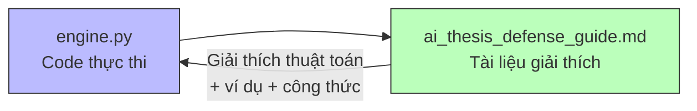

# 🔍 Giải Thích Chi Tiết: `engine.py` & `ai_thesis_defense_guide.md`

---

# PHẦN 1: `engine.py` — Post Recommendation Engine

> File: [engine.py](file:///Users/dophong/Documents/Coding/Trendify/trendify-ai/app/engines/post/engine.py)

## 1.1 Docstring & Import (dòng 1–21)

```python
"""
Post Recommendation Engine — Content-Based Filtering.
Two scoring strategies:
  1. Content-Based Filtering  (TF-IDF + Cosine Similarity)
  2. Popularity + Freshness   (Engagement × Time Decay)
Adaptive weights based on user's interaction history (Cold Start handling).
"""
```

**Giải thích:** Mô tả engine có **2 chiến lược** chấm điểm bài viết, và dùng **trọng số thích nghi** để xử lý user mới (Cold Start).

```python
import time                              # Đo thời gian tính toán
from datetime import datetime, timedelta, timezone  # Xử lý thời gian
import numpy as np                        # Mảng số, normalize, argsort
from bson import ObjectId                 # ID dạng MongoDB
from sklearn.feature_extraction.text import TfidfVectorizer  # Biến text → vector
from sklearn.metrics.pairwise import cosine_similarity       # Đo độ giống nhau
from app.services.mongo_service import MongoService  # Truy vấn MongoDB
from app.services.redis_service import RedisService  # Cache kết quả
from app.utils.normalization import min_max_normalize, time_decay  # Hàm tiện ích
```

**Mỗi import dùng để làm gì:**
| Import | Mục đích |
|--------|----------|
| `time` | Đo tổng thời gian xử lý (ms) |
| `numpy` | Normalize mảng điểm, sắp xếp |
| `TfidfVectorizer` | Biến text thành vector số (TF-IDF) |
| `cosine_similarity` | Tính độ giống nhau giữa 2 vector |
| `MongoService` | Đọc posts, likes, saves, comments, follows |
| `RedisService` | Cache kết quả gợi ý (30 phút) |

---

## 1.2 Hằng số & Constructor (dòng 24–31)

```python
POST_CACHE_TTL = 30 * 60  # 30 phút = 1800 giây
```

Cache tồn tại 30 phút → trong 30 phút, cùng user cùng page sẽ nhận kết quả cũ, không tính lại.

```python
class PostRecommendationEngine:
    def __init__(self):
        self.mongo = MongoService.get_instance()  # Singleton MongoDB
        self.redis = RedisService.get_instance()  # Singleton Redis
```

**Singleton pattern:** chỉ tạo 1 instance duy nhất cho MongoDB/Redis connection.

---

## 1.3 Hàm chính `recommend()` (dòng 33–177)

### Input:
```python
async def recommend(
    self,
    user_id: str,       # ID người dùng cần gợi ý
    limit: int = 20,    # Số bài mỗi trang (mặc định 20)
    cursor: str | None = None,  # Cursor phân trang (chưa dùng)
    page: int = 0,      # Số trang (0, 1, 2, ...)
) -> dict:
```

### Output (kiểu `dict`):
```python
{
    "postIds": ["id1", "id2", ...],   # Danh sách ID bài viết đã xếp hạng
    "scores": [0.95, 0.87, ...],      # Điểm tương ứng (cao → phù hợp hơn)
    "nextCursor": "1" or None,        # Trang tiếp theo (None = hết)
    "meta": {
        "strategy": {"content": 0.6, "popularity": 0.4},
        "candidateCount": 450,
        "userInteractions": 35,
        "coldStart": False,
        "computeTimeMs": 120,
        "source": "cache"  # (chỉ khi lấy từ cache)
    }
}
```

### Từng bước bên trong `recommend()`:

---

### Bước 1: Check Cache (dòng 42–46)

```python
cache_key = f"ai:feed:{user_id}:p{page}"
cached = await self.redis.get(cache_key)
if cached:
    return {**cached, "meta": {**cached.get("meta", {}), "source": "cache"}}
```

- Tạo key cache theo `user_id` + `page` (VD: `ai:feed:abc123:p0`)
- Nếu Redis có → trả luôn, thêm `"source": "cache"` vào meta
- **Tại sao?** Tránh tính toán lại trong 30 phút → tiết kiệm CPU

---

### Bước 2: Build User Profile (dòng 50–56)

```python
liked_ids, saved_ids, commented_ids, following_ids = (
    await self._build_user_profile(user_oid)
)
interacted_ids = set(liked_ids + saved_ids + commented_ids)
interaction_count = len(interacted_ids)
```

- Gọi `_build_user_profile()` lấy 4 danh sách song song (asyncio.gather)
- `interacted_ids` = **hợp** (union) tất cả bài đã tương tác (loại trùng nhờ `set`)
- `interaction_count` = tổng số bài unique đã tương tác → quyết định trọng số

---

### Bước 3: Adaptive Weights (dòng 58–68)

```python
if interaction_count < 5:
    weights = {"content": 0.10, "popularity": 0.90}   # User mới → xem bài hot
elif interaction_count < 20:
    weights = {"content": 0.40, "popularity": 0.60}
elif interaction_count < 50:
    weights = {"content": 0.60, "popularity": 0.40}
else:
    weights = {"content": 0.75, "popularity": 0.25}   # User cũ → cá nhân hóa
```

**Logic:** User mới (< 5 tương tác) → TF-IDF chưa có đủ data → dựa 90% vào bài trending. User lâu năm (≥ 50) → TF-IDF đã biết rõ sở thích → ưu tiên 75% content matching.

---

### Bước 4: Fetch Candidate Posts (dòng 70–101)

```python
candidate_filter = {
    "status": "active",                              # Bài còn hoạt động
    "settings.visibility": "public",                 # Bài công khai
    "replyToId": None,                               # Không phải reply
    "createdAt": {"$gte": now - timedelta(days=14)}, # Trong 14 ngày gần đây
}
if candidate_oid_exclusions:
    candidate_filter["_id"] = {"$nin": candidate_oid_exclusions}  # Loại bài đã tương tác
```

- Chỉ lấy bài **active, public, không phải reply, trong 14 ngày**
- **Loại trừ** bài user đã like/save/comment (không gợi ý lại)
- Lấy tối đa **500 bài** gần nhất (`to_list(500)`)
- Projection chỉ lấy các field cần: `_id, authorId, content, hashtags, counters, createdAt, type`

---

### Bước 5: Tính Content Scores (dòng 118–121)

```python
content_scores = await self._content_based_scores(user_oid, interacted_ids, candidates)
```

→ Trả về `list[float]` dài bằng `candidates`, mỗi giá trị là **cosine similarity** giữa user profile và bài đó (0.0 ~ 1.0).

---

### Bước 6: Tính Popularity Scores (dòng 123–124)

```python
pop_scores = self._popularity_scores(candidates, now)
```

→ Trả về `list[float]`, mỗi giá trị = `engagement × freshness`.

---

### Bước 7: Normalize + Fusion (dòng 126–133)

```python
content_norm = min_max_normalize(np.array(content_scores))  # Đưa về [0, 1]
pop_norm = min_max_normalize(np.array(pop_scores))           # Đưa về [0, 1]

final_scores = weights["content"] * content_norm + weights["popularity"] * pop_norm
```

- **Min-Max Normalize:** đưa mọi giá trị về khoảng [0, 1] để so sánh công bằng
- **Weighted Fusion:** nhân trọng số rồi cộng lại → điểm cuối cùng

---

### Bước 8: Following Boost (dòng 135–140)

```python
for i, post in enumerate(candidates):
    if str(post["authorId"]) in following_set:
        final_scores[i] *= 1.25  # +25%
```

Bài từ người mình follow → nhân thêm 25%.

---

### Bước 9: Author Diversity (dòng 142–144)

```python
final_scores = self._apply_author_diversity(candidates, final_scores)
```

Nếu 1 author có > 3 bài trong top → bài thứ 4+ bị giảm 70% điểm.

---

### Bước 10: Sort & Paginate (dòng 146–177)

```python
ranked_indices = np.argsort(-final_scores)  # Sắp xếp giảm dần
start_idx = page * limit                     # VD: page=1, limit=20 → start=20
end_idx = start_idx + limit                  # end=40
page_indices = ranked_indices[start_idx:end_idx]
post_ids = [str(candidates[i]["_id"]) for i in page_indices]
scores = [round(float(final_scores[i]), 4) for i in page_indices]
```

- Sắp xếp theo điểm giảm dần
- Cắt lấy đúng trang hiện tại
- Cache kết quả vào Redis 30 phút

---

## 1.4 `_content_based_scores()` (dòng 181–234)

**Input:** `user_oid`, `interacted_ids` (set bài đã tương tác), `candidates` (500 bài)
**Output:** `list[float]` — cosine similarity cho mỗi candidate

**Luồng:**
1. Lấy tối đa 200 bài đã tương tác từ MongoDB
2. Ghép nội dung tất cả → `user_text` (1 chuỗi dài = "sở thích" user)
3. Mỗi candidate → `candidate_texts` (list các chuỗi)
4. TF-IDF: biến `[user_text] + candidate_texts` thành ma trận vector
5. Cosine Similarity: so `user_vec` (dòng 0) với mỗi `post_vec` (dòng 1+)
6. Nếu không có data → trả `[0.0, 0.0, ...]`

---

## 1.5 `_popularity_scores()` (dòng 238–264)

**Input:** `candidates`, `now`
**Output:** `list[float]` — popularity score mỗi bài

```python
engagement = (
    likeCount    × 1.0
  + commentCount × 2.0   # Comment quan trọng hơn like
  + saveCount    × 3.0   # Save quan trọng nhất
  + shareCount   × 2.5
  + viewCount    × 0.1   # View ít giá trị nhất
)
freshness = time_decay(age_hours, half_life_hours=72)  # Giảm 50% sau 3 ngày
score = engagement × freshness
```

---

## 1.6 `_apply_author_diversity()` (dòng 268–287)

**Input:** `candidates`, `scores`, `max_per_author=3`
**Output:** `np.ndarray` scores đã điều chỉnh

- Duyệt theo thứ tự điểm cao → thấp
- Đếm số bài mỗi author
- Bài thứ 4+ → nhân `×0.3` (giảm 70%)

---

## 1.7 `_post_to_text()` (dòng 291–302)

```python
def _post_to_text(self, post: dict) -> str:
    parts = []
    content = post.get("content", "")
    if content:
        parts.append(content)
    for ht in post.get("hashtags", []):
        tag = ht.get("tag", "")
        if tag:
            parts.append(tag)
            parts.append(tag)  # Lặp 2 lần → tăng trọng số hashtag trong TF-IDF
    return " ".join(parts)
```

**Trick:** Hashtag được lặp 2 lần → TF cao hơn → TF-IDF cho hashtag ảnh hưởng mạnh hơn.

---

## 1.8 `_build_user_profile()` (dòng 304–346)

**Input:** `user_oid` (ObjectId)
**Output:** `tuple[list[str], list[str], list[str], list[str]]` — (liked, saved, commented, following)

- 4 hàm async chạy **song song** bằng `asyncio.gather()`
- `get_liked()` → 300 bài đã like gần nhất
- `get_saved()` → 200 bài đã save
- `get_commented()` → 200 bài đã comment (status=active)
- `get_following()` → tất cả người đang follow (status=ACCEPTED)

---

# PHẦN 2: `ai_thesis_defense_guide.md`

> File: [ai_thesis_defense_guide.md](file:///Users/dophong/Documents/Coding/Trendify/docs/ai_thesis_defense_guide.md)

Đây là **tài liệu bảo vệ đồ án**, giải thích hệ thống AI cho hội đồng. Gồm **7 phần chính:**

---

## Phần 1: Tổng quan RS (dòng 18–34)

- Định nghĩa **Recommendation System**: phần mềm tự động dự đoán nội dung user quan tâm
- Ví dụ: YouTube, TikTok, Shopee
- Bảng tóm tắt: Trendify có **1 module** (Post Engine) — input là content + behavior + popularity, output là danh sách bài xếp hạng

---

## Phần 2: Phân loại thuật toán RS (dòng 37–83)

**3 trường phái:**

| Loại | Ý tưởng | Ưu | Nhược |
|------|---------|-----|-------|
| **Content-Based** ✅ | "Thích du lịch → gợi thêm du lịch" | Không cần data user khác, real-time | Thiếu đa dạng |
| **Collaborative** | "Người giống bạn thích gì → bạn cũng thích" | Phát hiện sở thích ẩn | Cold Start |
| **Hybrid** | Kết hợp cả hai | Bù nhược điểm nhau | Phức tạp |

**Tại sao chọn Content-Based + Popularity?** Vì phù hợp quy mô Trendify, không cần training model, xử lý được Cold Start bằng adaptive weights.

---

## Phần 3: Post Engine chi tiết (dòng 86–293)

Đây là **phần quan trọng nhất**, giải thích lại `engine.py` dưới dạng dễ hiểu cho hội đồng:

### Bước 0: Build User Profile
- Giải thích 4 loại data: liked (300), saved (200), commented (200), following (all)
- `interacted = liked ∪ saved ∪ commented`

### Bước 0.5: Adaptive Weights
- Bảng 4 mức trọng số theo interaction count
- Giải thích đây là **heuristic**, không cần loss function

### Strategy 1: TF-IDF + Cosine Similarity
- **TF-IDF** giải thích bằng công thức + ví dụ cụ thể ("du lịch Đà Nẵng")
- Cho thấy cách tính `TF = count/total`, `IDF = log(N/DF)`, `TF-IDF = TF × IDF`
- **Cosine Similarity** giải thích bằng công thức + ví dụ 2 chiều
- Kết quả: post du lịch → 0.997 (rất giống), post lập trình → 0.452 (khác)

### Strategy 2: Popularity + Freshness
- Engagement: weighted sum của like, comment, save, share, view
- Time Decay: hàm mũ `e^(-0.693 × t / 72)`, bảng giá trị từ 0h → 2 tuần
- Kết hợp: `popularity = engagement × freshness`

### 2 kỹ thuật bổ sung:
- Following Boost: ×1.25 cho bài từ người follow
- Author Diversity: ×0.3 (giảm 70%) cho bài thứ 4+ cùng tác giả

---

## Phần 4: Thư viện sử dụng (dòng 297–320)

Bảng 8 thư viện: FastAPI, Uvicorn, Motor, Redis, NumPy, scikit-learn, Pydantic, python-dotenv — kèm version và vai trò cụ thể.

---

## Phần 5: Hàm mất mát (dòng 324–390)

**Câu hỏi then chốt:** "Tại sao không dùng Loss Function?"

**Trả lời:** Vì hệ thống **KHÔNG training model**. Phân biệt 2 cách:

| Cách | Cần Loss? | Ví dụ |
|------|-----------|-------|
| Model-Based | ✅ Cần | Netflix (Matrix Factorization), TikTok (Deep Learning) |
| Heuristic-Based ✅ | ❌ Không | TF-IDF + Cosine, Popularity scoring |

Nếu muốn nâng cấp: có thể dùng Matrix Factorization với MSE Loss + L2 Regularization + SGD.

---

## Phần 6: Kiến trúc hệ thống (dòng 394–447)

**Sơ đồ 4 tầng:**
```
Frontend (React:3000) → Backend (Node.js:8000) → AI Service (Python:8001) → MongoDB + Redis
```

**Luồng 8 bước** khi user vào trang ForYou:
1. FE gửi request → 2. BE xác thực token → 3. BE gọi AI → 4. AI tính toán (cache/TF-IDF/popularity/fusion) → 5-6. BE enriches data → 7-8. Trả FE render

---

## Phần 7: Câu hỏi bảo vệ (dòng 451–492)

**8 câu Q&A thường gặp:**

| Q | Tóm tắt trả lời |
|---|-----------------|
| Q1: Tại sao Content-Based? | CF có Cold Start, CB phân tích nội dung nên hoạt động ngay |
| Q2: TF-IDF hạn chế gì? | Không hiểu ngữ nghĩa ("ẩm thực" ≠ "món ăn"), cải thiện bằng Word Embedding |
| Q3: Trọng số lấy từ đâu? | Nguyên tắc + thực nghiệm, tune bằng A/B testing |
| Q4: Tại sao không Deep Learning? | Data chưa đủ, tài nguyên hạn chế, heuristic đủ tốt |
| Q5: Cosine vs Euclidean? | Cosine đo hướng (phù hợp text), Euclidean đo khoảng cách (bị ảnh hưởng bởi độ dài) |
| Q6: Scale thế nào? | Redis cache, pagination, candidate limit 500, nâng cấp bằng FAISS |
| Q7: Metrics đánh giá? | Precision@K, NDCG, Coverage, A/B testing |
| Q8: Tại sao tách Python? | Python có ecosystem ML tốt nhất, pattern chuẩn industry |

---

# PHẦN 3: MỐI LIÊN HỆ GIỮA 2 FILE



| Khía cạnh | `engine.py` | `ai_thesis_defense_guide.md` |
|-----------|------------|------------------------------|
| **Vai trò** | Code chạy thật | Tài liệu thuyết trình |
| **Đối tượng** | Máy tính | Hội đồng bảo vệ |
| **Nội dung** | Implementation chi tiết | Giải thích lý thuyết + ví dụ |
| **TF-IDF** | `TfidfVectorizer(max_features=2000)` | Công thức TF × IDF + ví dụ "du lịch" |
| **Cosine** | `cosine_similarity(user_vec, post_vecs)` | Công thức vector + tính tay 2 chiều |
| **Cold Start** | `if interaction_count < 5: ...` | Bảng 4 mức + giải thích tại sao |

**Tóm lại:** `engine.py` là **"cái gì"** (what), `ai_thesis_defense_guide.md` là **"tại sao"** (why) và **"như thế nào"** (how to explain).
