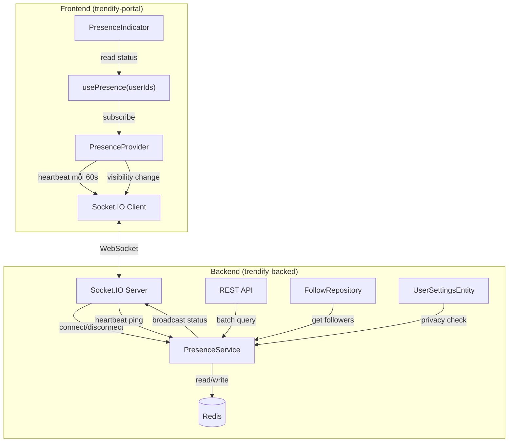
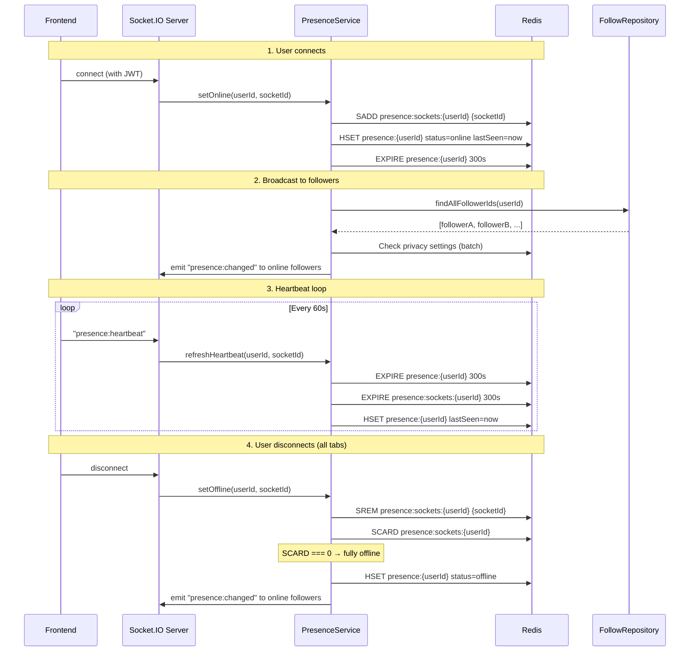
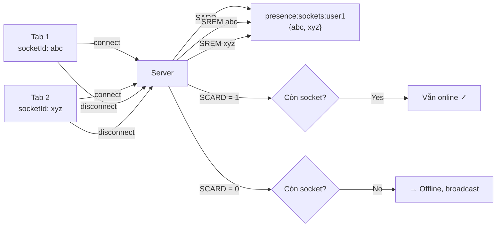

# Online Presence System — Trendify

Thiết kế chức năng online presence (trạng thái trực tuyến) chuẩn production-ready cho hệ thống mạng xã hội Trendify.

---

## Tổng quan kiến trúc



### Luồng dữ liệu chính



---

## 1. Redis Schema Design

### Keys & Structure

| Key Pattern | Type | TTL | Mô tả |
|---|---|---|---|
| `presence:{userId}` | Hash | 300s (online) / 86400s (offline) | Status chính: `{status, lastSeen, idleSince?}` |
| `presence:sockets:{userId}` | Set | 300s | Tập hợp socketId đang kết nối (multi-tab) |
| `presence:privacy:{userId}` | String | 3600s | Cache privacy setting: `"all"` / `"nobody"` |

### Hash fields cho `presence:{userId}`

```
status:     "online" | "idle" | "offline"
lastSeen:   timestamp (ms)
idleSince:  timestamp (ms) — chỉ set khi idle
```

### Tại sao dùng Redis Hash thay vì String?

- Cập nhật từng field riêng lẻ mà không cần read-modify-write
- Atomic `HSET` cho `lastSeen` trong heartbeat
- `HGETALL` trả về toàn bộ presence data trong 1 round-trip
- Mở rộng dễ dàng (thêm `device`, `platform` sau này)

### TTL Strategy

```
Online:  TTL 300s → nếu heartbeat chết → key tự expire → auto offline
Offline: TTL 86400s → giữ lastSeen cho "active X giờ trước"
Idle:    Giữ TTL 300s → vẫn cần heartbeat để duy trì
```

---

## 2. Backend — Proposed Changes

### 2.1. Domain Layer

#### [MODIFY] [user-setting.type.ts](file:///Users/dophong/Documents/Coding/Trendify/trendify-backed/src/domain/user-setting/user-setting.type.ts)

Thêm enum cho visibility trạng thái online:

```typescript
export enum EPresenceVisibility {
  ALL = "all",       // Tất cả đều thấy (công khai)
  NOBODY = "nobody", // Không ai thấy (ẩn hoàn toàn)
}
```

> [!NOTE]
> `showOnlineStatus: boolean` hiện tại trong `IUserSettingsProps` đã đủ cho MVP. Nếu sau này cần "chỉ follower thấy", có thể chuyển sang dùng `EPresenceVisibility` với thêm giá trị `FOLLOWER`. Hiện tại giữ boolean cho đơn giản.

---

#### [MODIFY] [presence.service.ts](file:///Users/dophong/Documents/Coding/Trendify/trendify-backed/src/application/services/presence.service.ts)

Mở rộng interface hiện tại thêm heartbeat, idle, và broadcast capability:

```typescript
export enum EPresenceStatus {
  ONLINE = "online",
  IDLE = "idle",
  OFFLINE = "offline",
}

export interface PresenceStatus {
  status: EPresenceStatus;          // thay isOnline → enum 3 trạng thái
  lastSeen?: Date;
  idleSince?: Date;                 // thời điểm chuyển idle
}

export interface IPresenceService {
  setOnline(userId: string, socketId: string): Promise<void>;
  setOffline(userId: string, socketId: string): Promise<boolean>;  // trả true nếu fully offline
  setIdle(userId: string): Promise<void>;
  setActive(userId: string): Promise<void>;                        // từ idle → online
  
  refreshHeartbeat(userId: string, socketId: string): Promise<void>;
  
  getStatus(userId: string): Promise<PresenceStatus>;
  getStatusBatch(userIds: string[]): Promise<Map<string, PresenceStatus>>;
  getOnlineUserIds(userIds: string[]): Promise<string[]>;
}
```

---

### 2.2. Infrastructure Layer

#### [MODIFY] [presence.service.ts](file:///Users/dophong/Documents/Coding/Trendify/trendify-backed/src/infrastructure/services/presence.service.ts)

Rewrite `RedisPresenceService` để:

1. **Multi-tab chính xác**: Dùng `SADD/SREM/SCARD` đúng cách cho socket set
2. **Heartbeat**: Method `refreshHeartbeat()` renew TTL
3. **Idle detection**: Server-side idle → khi client gửi `presence:idle`
4. **Batch pipeline**: `getStatusBatch()` dùng Redis pipeline thay vì Promise.all

```typescript
export class RedisPresenceService implements IPresenceService {
  private readonly redis: RedisService;
  
  private readonly PRESENCE_PREFIX = "presence:";
  private readonly SOCKET_SET_PREFIX = "presence:sockets:";
  private readonly ONLINE_TTL = 300;    // 5 phút
  private readonly OFFLINE_TTL = 86400; // 24 giờ

  async setOnline(userId: string, socketId: string): Promise<void> {
    const socketKey = `${this.SOCKET_SET_PREFIX}${userId}`;
    const presenceKey = `${this.PRESENCE_PREFIX}${userId}`;

    // Pipeline: thêm socket + set status + set TTL
    await this.redis.sadd(socketKey, socketId);
    await this.redis.hSet(presenceKey, "status", "online");
    await this.redis.hSet(presenceKey, "lastSeen", Date.now().toString());
    await this.redis.expire(presenceKey, this.ONLINE_TTL);
    await this.redis.expire(socketKey, this.ONLINE_TTL);
  }

  async setOffline(userId: string, socketId: string): Promise<boolean> {
    const socketKey = `${this.SOCKET_SET_PREFIX}${userId}`;
    const presenceKey = `${this.PRESENCE_PREFIX}${userId}`;

    // Xóa socket cụ thể khỏi set
    await this.redis.srem(socketKey, socketId);  // Cần thêm srem vào RedisService
    
    // Check còn socket nào không
    const remaining = await this.redis.scard(socketKey); // Cần thêm scard vào RedisService
    
    if (remaining === 0) {
      // Fully offline
      await this.redis.hSet(presenceKey, "status", "offline");
      await this.redis.hSet(presenceKey, "lastSeen", Date.now().toString());
      await this.redis.expire(presenceKey, this.OFFLINE_TTL);
      await this.redis.del(socketKey);
      return true; // fully offline
    }
    
    return false; // still has other tabs
  }

  async setIdle(userId: string): Promise<void> {
    const presenceKey = `${this.PRESENCE_PREFIX}${userId}`;
    await this.redis.hSet(presenceKey, "status", "idle");
    await this.redis.hSet(presenceKey, "idleSince", Date.now().toString());
  }

  async setActive(userId: string): Promise<void> {
    const presenceKey = `${this.PRESENCE_PREFIX}${userId}`;
    await this.redis.hSet(presenceKey, "status", "online");
    await this.redis.hSet(presenceKey, "lastSeen", Date.now().toString());
    // Xóa idleSince field
    await this.redis.hdel(presenceKey, "idleSince");  // Cần thêm hdel vào RedisService
  }

  async refreshHeartbeat(userId: string, socketId: string): Promise<void> {
    const socketKey = `${this.SOCKET_SET_PREFIX}${userId}`;
    const presenceKey = `${this.PRESENCE_PREFIX}${userId}`;

    // Renew TTL cho cả 2 keys
    await this.redis.hSet(presenceKey, "lastSeen", Date.now().toString());
    await this.redis.expire(presenceKey, this.ONLINE_TTL);
    await this.redis.expire(socketKey, this.ONLINE_TTL);
  }

  async getStatus(userId: string): Promise<PresenceStatus> {
    const presenceKey = `${this.PRESENCE_PREFIX}${userId}`;
    const data = await this.redis.hGetAll(presenceKey);

    if (!data || Object.keys(data).length === 0) {
      return { status: EPresenceStatus.OFFLINE };
    }

    return {
      status: (data.status as EPresenceStatus) || EPresenceStatus.OFFLINE,
      lastSeen: data.lastSeen ? new Date(parseInt(data.lastSeen, 10)) : undefined,
      idleSince: data.idleSince ? new Date(parseInt(data.idleSince, 10)) : undefined,
    };
  }

  // getStatusBatch & getOnlineUserIds giữ nguyên logic, chỉ update type
}
```

> [!IMPORTANT]  
> Cần bổ sung 3 method vào `RedisService`: `srem()`, `scard()`, `hdel()`. Hiện tại đã có `sadd()` nhưng thiếu các method set operations bổ sung.

---

#### [MODIFY] [redis.service.ts](file:///Users/dophong/Documents/Coding/Trendify/trendify-backed/src/infrastructure/services/redis.service.ts)

Thêm 3 methods mới:

```typescript
// SET OPERATIONS (bổ sung)
async srem(key: string, member: string): Promise<number> {
  return await this.client.srem(key, member);
}

async scard(key: string): Promise<number> {
  return await this.client.scard(key);
}

// HASH OPERATIONS (bổ sung)
async hdel(key: string, ...fields: string[]): Promise<number> {
  return await this.client.hdel(key, ...fields);
}
```

---

### 2.3. Socket.IO Layer — Presence Events

#### [MODIFY] [socket.config.ts](file:///Users/dophong/Documents/Coding/Trendify/trendify-backed/src/config/socket.config.ts)

Thêm presence event handlers vào connection handler:

```typescript
io.on("connection", async (socket) => {
  const userId = socket.data.userId;
  socket.join(`user:${userId}`);

  // ── Presence: mark online & broadcast ──
  const presenceService = new RedisPresenceService();
  await presenceService.setOnline(userId, socket.id);
  await broadcastPresenceChange(io, userId, "online", presenceService);

  // ── Existing handlers (post:join, post:leave) ──
  // ... giữ nguyên

  // ── Heartbeat handler ──
  socket.on("presence:heartbeat", async () => {
    await presenceService.refreshHeartbeat(userId, socket.id);
  });

  // ── Idle/Active toggles ──
  socket.on("presence:idle", async () => {
    await presenceService.setIdle(userId);
    await broadcastPresenceChange(io, userId, "idle", presenceService);
  });

  socket.on("presence:active", async () => {
    await presenceService.setActive(userId);
    await broadcastPresenceChange(io, userId, "online", presenceService);
  });

  // ── Disconnect: mark offline & broadcast ──
  socket.on("disconnect", async (reason) => {
    console.log(`🔌 Socket disconnected: ${userId} (${reason})`);
    const fullyOffline = await presenceService.setOffline(userId, socket.id);
    if (fullyOffline) {
      await broadcastPresenceChange(io, userId, "offline", presenceService);
    }
  });
});
```

#### Broadcast helper function

```typescript
/**
 * Broadcast presence change chỉ tới follower đang online.
 * 
 * Flow:
 * 1. Check user có bật showOnlineStatus không → nếu tắt, không broadcast
 * 2. Lấy danh sách follower IDs
 * 3. Filter chỉ lấy follower đang online (có socket connected)
 * 4. Emit "presence:changed" tới từng follower room
 */
async function broadcastPresenceChange(
  io: SocketIOServer,
  userId: string,
  status: "online" | "idle" | "offline",
  presenceService: RedisPresenceService
): Promise<void> {
  // 1. Privacy check — dùng UserSettingsRepository
  const settings = await userSettingsRepo.findByUserId(userId);
  if (settings && !settings.shouldShowOnlineStatus()) {
    return; // User ẩn trạng thái → không broadcast
  }

  // 2. Lấy followers
  const followerIds = await followRepo.findAllFollowerIds(userId);
  if (followerIds.length === 0) return;

  // 3. Chỉ emit tới followers đang có socket connected
  // (tối ưu: không cần check Redis, Socket.IO tự skip room trống)
  const payload = {
    userId,
    status,
    lastSeen: Date.now(),
  };

  for (const followerId of followerIds) {
    io.to(`user:${followerId}`).emit("presence:changed", payload);
  }
}
```

> [!WARNING]
> `findAllFollowerIds()` hiện chưa có trong `IFollowRepository`. Cần thêm method mới (tương tự `findAllFollowingIds()` đã tồn tại).

---

### 2.4. REST API Endpoints

#### [NEW] Thêm routes vào user.route.ts

| Method | Endpoint | Mô tả |
|---|---|---|
| `GET` | `/api/users/:userId/presence` | Lấy trạng thái 1 user (có privacy check) |
| `POST` | `/api/users/presence/batch` | Batch query trạng thái nhiều user |

```typescript
// GET /api/users/:userId/presence
// → Trả về { status, lastSeen } nếu user cho phép xem
route.get(
  USER_ROUTES.USER_PRESENCE,
  validateParams(schema.getUserPresenceSchema),
  presenceController.getUserPresence,
);

// POST /api/users/presence/batch
// Body: { userIds: string[] }
// → Trả về { [userId]: { status, lastSeen } }
route.post(
  USER_ROUTES.PRESENCE_BATCH,
  validate(schema.batchPresenceSchema),
  presenceController.getBatchPresence,
);
```

#### Presence Controller logic

```typescript
class PresenceController {
  async getUserPresence(req, res) {
    const viewerId = req.user.sub;
    const targetId = req.params.userId;

    // 1. Check privacy: target có bật showOnlineStatus?
    const settings = await userSettingsRepo.findByUserId(targetId);
    if (settings && !settings.shouldShowOnlineStatus()) {
      return res.json({ status: "hidden" });
    }

    // 2. Get status từ Redis
    const presence = await presenceService.getStatus(targetId);
    return res.json(presence);
  }

  async getBatchPresence(req, res) {
    const { userIds } = req.body; // max 50

    // 1. Batch get settings → filter ra users cho phép xem
    // 2. Batch get presence từ Redis
    // 3. Merge results
    const result = await presenceService.getStatusBatch(userIds);
    // ... privacy filtering
    return res.json(Object.fromEntries(result));
  }
}
```

---

### 2.5. Follow Repository — Thêm method mới

#### [MODIFY] [follow.abstract.ts](file:///Users/dophong/Documents/Coding/Trendify/trendify-backed/src/domain/follow/follow.abstract.ts)

```typescript
/**
 * Get ALL user IDs that follow this user (ACCEPTED) — no pagination
 * Dùng cho presence broadcast
 */
findAllFollowerIds(userId: string): Promise<string[]>;
```

---

## 3. Frontend — Proposed Changes

### 3.1. Socket Event Types

#### [MODIFY] [socket.ts](file:///Users/dophong/Documents/Coding/Trendify/trendify-portal/src/services/socket.ts)

Thêm presence events vào type definitions:

```typescript
// ── Presence ──
export interface PresenceChangedPayload {
  userId: string;
  status: "online" | "idle" | "offline";
  lastSeen: number; // timestamp ms
}

interface ServerToClientEvents {
  // ... existing events
  "presence:changed": (payload: PresenceChangedPayload) => void;
}

interface ClientToServerEvents {
  // ... existing events
  "presence:heartbeat": () => void;
  "presence:idle": () => void;
  "presence:active": () => void;
}
```

---

### 3.2. Presence Provider

#### [NEW] `src/provider/PresenceProvider.tsx`

Provider quản lý:
- **Heartbeat interval**: Ping server mỗi 60s
- **Idle detection**: Dùng `visibilitychange` + `mousemove/keydown` debounce
- **Presence store**: In-memory Map `userId → PresenceStatus`
- **Socket listener**: Nhận `presence:changed` events

```typescript
// Pseudo-code structure
const PresenceProvider = ({ children }) => {
  const { isConnected } = useSocket();
  const socket = getSocket();
  
  // ── In-memory presence cache ──
  const presenceMap = useRef<Map<string, PresenceStatus>>(new Map());
  const [version, setVersion] = useState(0); // trigger re-render
  
  // ── Heartbeat: mỗi 60s ──
  useEffect(() => {
    if (!isConnected) return;
    const timer = setInterval(() => {
      socket.emit("presence:heartbeat");
    }, 60_000);
    return () => clearInterval(timer);
  }, [isConnected]);
  
  // ── Idle detection ──
  useEffect(() => {
    let idleTimer: NodeJS.Timeout;
    const IDLE_THRESHOLD = 5 * 60 * 1000; // 5 phút
    
    const resetIdle = () => {
      clearTimeout(idleTimer);
      // Nếu đang idle → chuyển active
      if (currentStatus === "idle") {
        socket.emit("presence:active");
      }
      idleTimer = setTimeout(() => {
        socket.emit("presence:idle");
      }, IDLE_THRESHOLD);
    };
    
    // Tab visibility
    const handleVisibility = () => {
      if (document.hidden) {
        socket.emit("presence:idle");
      } else {
        socket.emit("presence:active");
        resetIdle();
      }
    };
    
    document.addEventListener("visibilitychange", handleVisibility);
    window.addEventListener("mousemove", resetIdle, { passive: true });
    window.addEventListener("keydown", resetIdle, { passive: true });
    
    resetIdle();
    return () => { /* cleanup */ };
  }, [isConnected]);
  
  // ── Listen presence changes ──
  useEffect(() => {
    if (!isConnected) return;
    
    const handlePresenceChanged = (payload: PresenceChangedPayload) => {
      presenceMap.current.set(payload.userId, {
        status: payload.status,
        lastSeen: new Date(payload.lastSeen),
      });
      setVersion(v => v + 1); // notify subscribers
    };
    
    socket.on("presence:changed", handlePresenceChanged);
    return () => socket.off("presence:changed", handlePresenceChanged);
  }, [isConnected]);
  
  return (
    <PresenceContext.Provider value={{ presenceMap, version }}>
      {children}
    </PresenceContext.Provider>
  );
};
```

---

### 3.3. Custom Hook

#### [NEW] `src/hooks/usePresence.ts`

```typescript
/**
 * Hook để lấy presence status của 1 hoặc nhiều users.
 * 
 * Ưu tiên: Socket real-time → REST API fallback
 * 
 * Sử dụng:
 *   const { status, lastSeen } = usePresence(userId);
 *   const presenceMap = usePresenceBatch(userIds);
 */

export const usePresence = (userId: string): PresenceStatus => {
  const { presenceMap, version } = usePresenceContext();
  
  // Lấy từ in-memory cache (populated bởi socket events)
  const status = presenceMap.current.get(userId);
  
  // Nếu chưa có → fetch 1 lần qua REST API
  useEffect(() => {
    if (!status && userId) {
      fetchPresence(userId).then(data => {
        presenceMap.current.set(userId, data);
        // trigger re-render
      });
    }
  }, [userId]);
  
  return status ?? { status: "offline" };
};

export const usePresenceBatch = (userIds: string[]): Map<string, PresenceStatus> => {
  // Batch fetch cho conversation list, follower list, etc.
  // Dùng React Query với staleTime: 30s
};
```

---

### 3.4. UI Component

#### [NEW] `src/components/PresenceIndicator.tsx`

```
Visual design:
┌─────┐
│     │  ← Avatar
│     │
└──●──┘  ← Indicator dot (bottom-right corner)

● Xanh lá (#22c55e) — Online
● Vàng (#eab308) — Idle  
● Xám (#6b7280) — Offline
○ Viền trắng 2px xung quanh dot
```

```typescript
interface PresenceIndicatorProps {
  userId: string;
  size?: "sm" | "md" | "lg";   // 8px | 10px | 14px
  showLastSeen?: boolean;       // hiển thị "Active 5m ago"
}

const INDICATOR_COLORS = {
  online: "#22c55e",
  idle: "#eab308",
  offline: "#9ca3af",
};

const PresenceIndicator = ({ userId, size = "md" }) => {
  const { status } = usePresence(userId);
  
  return (
    <span
      className="presence-indicator"
      style={{
        backgroundColor: INDICATOR_COLORS[status],
        width: SIZE_MAP[size],
        height: SIZE_MAP[size],
      }}
    />
  );
};
```

---

## 4. Edge Cases & Xử lý

### 4.1. Multi-tab Support



**Xử lý**: Dùng Redis Set (`SADD/SREM/SCARD`) để track từng socketId. Chỉ set offline khi `SCARD === 0`.

### 4.2. Mất mạng đột ngột (Network Loss)

| Tình huống | Xử lý |
|---|---|
| Client mất mạng | Socket.IO phát hiện qua transport close → trigger `disconnect` event trên server |
| Server mất kết nối tới client | TCP timeout (Socket.IO `pingTimeout`: 20s) → trigger `disconnect` |
| Redis key hết TTL | Nếu heartbeat dừng 5 phút → key tự expire → user được coi là offline |

**Fallback**: TTL 300s trên Redis key đảm bảo dù server crash, user vẫn tự chuyển offline sau 5 phút.

### 4.3. Tab ngủ (Browser throttling)

Trình duyệt throttle `setInterval` khi tab ẩn (≥1 phút/lần). Giải pháp:

```typescript
// Dùng visibilitychange thay vì chỉ setInterval
document.addEventListener("visibilitychange", () => {
  if (!document.hidden) {
    // Tab vừa active lại → gửi heartbeat ngay lập tức
    socket.emit("presence:heartbeat");
    socket.emit("presence:active");
  }
});
```

### 4.4. Server restart / Deploy

```
1. Khi server restart → tất cả socket disconnect → trigger setOffline
2. TTL trên Redis đảm bảo stale keys tự cleanup
3. Client auto-reconnect (Socket.IO built-in) → trigger setOnline lại
```

### 4.5. Race conditions

| Race condition | Giải pháp |
|---|---|
| Disconnect + Connect cùng lúc (switch tab nhanh) | Redis Set tracks socket IDs — mỗi ID unique |
| Heartbeat gửi sau disconnect | `EXPIRE` trên key đã bị xóa = no-op (Redis safe) |
| Batch presence query giữa lúc status đang đổi | Acceptable: eventual consistency (ms-level delay) |

### 4.6. Mobile browser / PWA

| Tình huống | Xử lý |
|---|---|
| App bị kill | Socket disconnect → normal offline flow |
| Lock screen | `visibilitychange` → emit idle |
| Slow network | Socket.IO reconnect with backoff → khi reconnect xong → setOnline |

---

## 5. Performance Considerations

### 5.1. Broadcast Optimization

```
Vấn đề: User có 10,000 followers → broadcast tới 10,000 socket rooms?

Giải pháp tầng 1 (hiện tại, đủ cho ~10K concurrent):
  - Socket.IO room emit rất hiệu quả (no-op nếu room trống)
  - Follower IDs cache trong Redis (findAllFollowerIds)

Giải pháp tầng 2 (khi scale >50K concurrent):
  - Redis Pub/Sub cho cross-instance broadcast
  - Socket.IO Redis Adapter
  - Chunked broadcast (emit 100 followers/batch)
  
Giải pháp tầng 3 (100K+ concurrent):
  - Dedicated presence microservice
  - Presence-specific Redis cluster
  - Push via message queue (RabbitMQ) thay vì direct emit
```

### 5.2. Redis Operations per Event

```
setOnline:   ~5 Redis ops (SADD + HSET×2 + EXPIRE×2)
heartbeat:   ~3 Redis ops (HSET + EXPIRE×2)
setOffline:  ~5 Redis ops (SREM + SCARD + HSET×2 + EXPIRE/DEL)
getStatus:   ~1 Redis op  (HGETALL)
getBatch:    ~N Redis ops (N × HGETALL, dùng pipeline giảm round-trips)
```

→ Một user online liên tục: **~3 ops mỗi 60s** (heartbeat) = **0.05 ops/s** — rất thấp.

### 5.3. Memory Footprint

```
Per online user: 
  presence:{userId}:       ~80 bytes (3 hash fields)
  presence:sockets:{userId}: ~50 bytes (1-3 socketIds)
  Total: ~130 bytes/user

100,000 online users: ~13MB Redis memory — negligible
```

---

## 6. File Changes Summary

### Backend (`trendify-backed`)

| Action | File | Mô tả |
|---|---|---|
| MODIFY | `src/application/services/presence.service.ts` | Mở rộng interface: thêm idle, heartbeat, active |
| MODIFY | `src/infrastructure/services/presence.service.ts` | Rewrite implementation: multi-tab fix, idle, heartbeat |
| MODIFY | `src/infrastructure/services/redis.service.ts` | Thêm `srem()`, `scard()`, `hdel()` |
| MODIFY | `src/config/socket.config.ts` | Thêm presence events: heartbeat, idle, active, broadcast |
| MODIFY | `src/domain/follow/follow.abstract.ts` | Thêm `findAllFollowerIds()` |
| MODIFY | `src/infrastructure/database/repositories/follow.repository.impl` | Implement `findAllFollowerIds()` |
| NEW | `src/interfaces/controllers/presence.controller.ts` | REST API controller |
| MODIFY | `src/interfaces/routes/user.route.ts` | Thêm presence routes |
| NEW | `src/infrastructure/injection/presence.injection.ts` | DI wiring |

### Frontend (`trendify-portal`)

| Action | File | Mô tả |
|---|---|---|
| MODIFY | `src/services/socket.ts` | Thêm presence event types |
| NEW | `src/provider/PresenceProvider.tsx` | Presence state management + heartbeat + idle |
| NEW | `src/provider/presence-context.shared.ts` | Context + types |
| NEW | `src/hooks/usePresence.ts` | Custom hook |
| NEW | `src/components/PresenceIndicator/index.tsx` | UI indicator component |
| NEW | `src/components/PresenceIndicator/styles.module.scss` | Indicator styles |
| MODIFY | `src/provider/Provider.tsx` | Wrap with PresenceProvider |

---

## 7. Open Questions

> [!IMPORTANT]
> **Idle threshold**: 5 phút không tương tác → chuyển idle. Con số này có phù hợp không? Facebook dùng ~5 phút, Slack dùng 10 phút.

> [!IMPORTANT]
> **Privacy scope MVP**: Hiện tại `showOnlineStatus: boolean` đã đủ (ẩn/hiện). Có cần mở rộng thành `EPresenceVisibility` (all / follower / nobody) không?

> [!IMPORTANT]
> **REST API for batch**: Khi mở trang followers list hoặc conversation list, fetch presence ban đầu bằng REST (vì socket chỉ push thay đổi). Có muốn dùng React Query cho cache này không? (recommend: yes, staleTime 30s)

> [!IMPORTANT]  
> **`findAllFollowerIds()`**: Với user có >10K followers, query MongoDB cho toàn bộ follower IDs sẽ tốn thời gian. Có muốn cache follower list trong Redis không? Hoặc chỉ broadcast tới online followers (check connected rooms trước)?

---

## 8. Verification Plan

### Automated Tests
1. Unit test `RedisPresenceService`: multi-tab connect/disconnect, TTL expiry, idle transitions
2. Integration test Socket events: heartbeat → presence refresh → broadcast
3. Test privacy: user tắt `showOnlineStatus` → không broadcast, REST trả "hidden"

### Manual Verification  
1. Mở 2 tabs → cả 2 đều online indicator → đóng 1 tab → vẫn online → đóng tab còn lại → offline
2. Để tab idle 5 phút → indicator chuyển vàng → move mouse → chuyển lại xanh
3. Tắt `showOnlineStatus` trong settings → follower không thấy indicator
4. Tắt mạng đột ngột → sau ~20s (Socket.IO pingTimeout) → indicator chuyển offline
