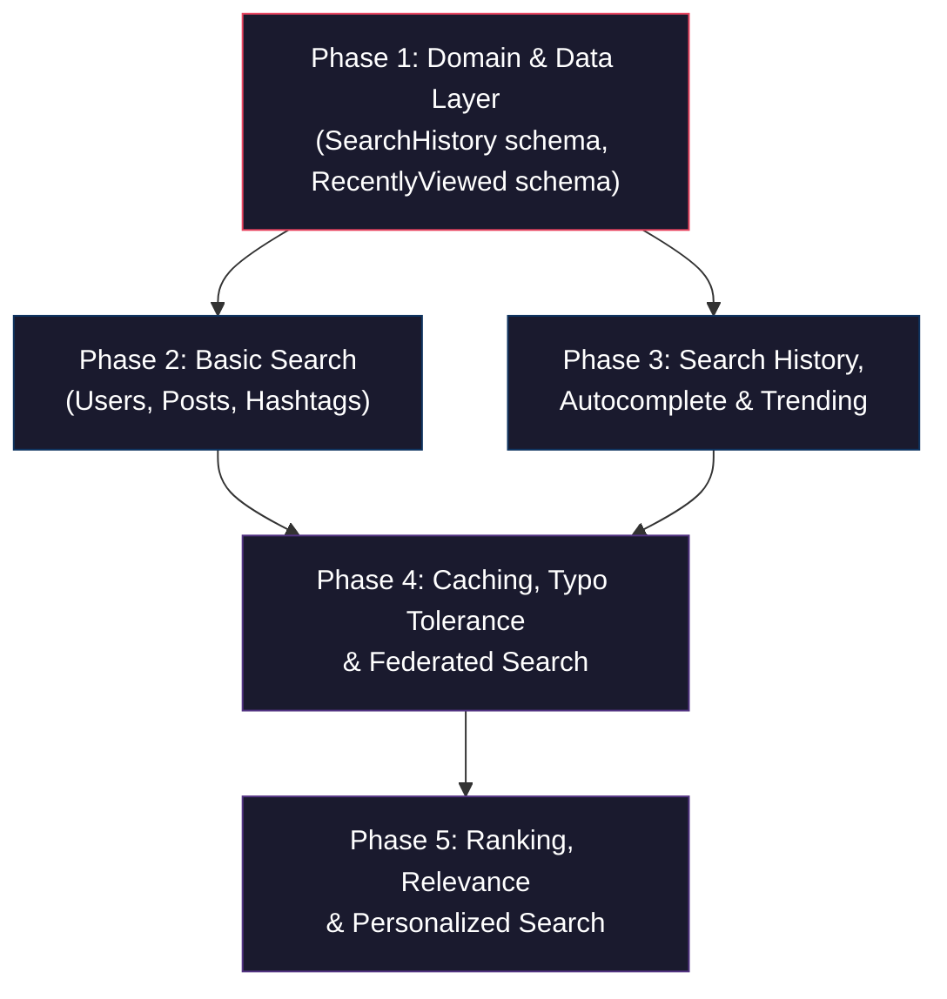

# Search System — Implementation Plan

## Overview

Xây dựng hệ thống Search toàn diện cho Trendify social media app theo kiến trúc Clean Architecture hiện có (domain → infrastructure → application → interfaces). Hệ thống bao gồm: basic search, search history, autocomplete, trending, caching, typo tolerance, federated search, ranking/relevance, và personalized search.

---

## Dependency Graph



---

## Complexity Summary

| Phase | Tính năng | Độ phức tạp | Files mới | Files sửa |
|-------|-----------|-------------|-----------|-----------|
| 1 | Domain & Data Layer | **Easy** | ~8 | ~2 |
| 2 | Basic Search (User, Post, Hashtag) | **Medium** | ~4 | ~3 |
| 3 | Search History, Autocomplete, Trending | **Medium** | ~5 | ~2 |
| 4 | Caching + Typo Tolerance + Federated Search | **Hard** | ~4 | ~3 |
| 5 | Ranking + Relevance + Personalized Search | **Hard** | ~3 | ~4 |

---

## Phase 1: Domain & Data Layer (Easy)

> **Mục tiêu**: Tạo domain models, schemas, và repositories cho SearchHistory & RecentlyViewed

### 1.1 SearchHistory Domain

#### [NEW] `src/domain/search/search.type.ts`
- Enum `ESearchType` = `user | post | hashtag`
- Interface `ISearchHistoryProps` — userId, keyword, searchType, resultCount, deletedAt, createdAt, updatedAt
- Interface `ISearchHistoryCreateInput` — userId, keyword, searchType, resultCount

#### [NEW] `src/domain/search/search.entity.ts`
- Class `SearchHistoryEntity` theo pattern hiện có (private props, getters, factory `create()`)
- Method `softDelete()` — set `deletedAt = new Date()`
- Method `isDeleted()` — check `deletedAt !== null`
- Method `updateTimestamp(resultCount)` — update timestamp + resultCount (dùng cho dedup logic)

#### [NEW] `src/domain/search/search.abstract.ts`
- Interface `ISearchHistoryRepository` với các methods:
  - `upsertSearch(userId, keyword, searchType, resultCount)` → dedup logic (tìm entry cùng keyword trong 1 giờ, nếu có thì update, nếu không thì tạo mới)
  - `findRecentByUser(userId, limit)` → lấy search history gần đây
  - `softDelete(userId, searchId)` → soft delete 1 entry
  - `softDeleteAll(userId)` → soft delete tất cả entries của user
  - `findByPrefix(userId, prefix, limit)` → autocomplete từ history
  - `countByUser(userId)` → đếm entries chưa bị xóa
  - `deleteOldest(userId, keepCount)` → giữ lại `keepCount` mới nhất, xóa phần còn lại

#### [NEW] `src/domain/search/index.ts`
- Re-export tất cả

### 1.2 RecentlyViewed Domain

#### [NEW] `src/domain/search/recently-viewed.type.ts`
- Enum `EViewedResourceType` = `user | post`
- Interface `IRecentlyViewedProps` — userId, resourceId, resourceType, viewedAt

#### [NEW] `src/domain/search/recently-viewed.abstract.ts`
- Interface `IRecentlyViewedRepository`:
  - `upsertView(userId, resourceId, resourceType)` → upsert (update viewedAt nếu đã tồn tại)
  - `findRecentByUser(userId, limit)` → lấy recently viewed
  - `deleteByUser(userId)` → xóa tất cả
  - `deleteByResource(userId, resourceId)` → xóa 1 entry

### 1.3 Mongoose Models

#### [NEW] `src/infrastructure/database/models/search-history.model.ts`
- Schema `SearchHistory`:
  - `userId` (ObjectId, ref: User, required, index)
  - `keyword` (String, required, lowercase, trim)
  - `searchType` (String, enum: ESearchType)
  - `resultCount` (Number, default: 0)
  - `deletedAt` (Date, default: null)
  - timestamps: true
- **Indexes**:
  - Compound: `{ userId: 1, deletedAt: 1, updatedAt: -1 }` — user history query
  - Compound: `{ userId: 1, keyword: 1, deletedAt: 1 }` — dedup lookup
  - Text: `{ keyword: "text" }` — autocomplete prefix search
  - **TTL index**: `{ updatedAt: 1 }` với `expireAfterSeconds: 30 * 24 * 60 * 60` (30 ngày)

#### [NEW] `src/infrastructure/database/models/recently-viewed.model.ts`
- Schema `RecentlyViewed`:
  - `userId` (ObjectId, ref: User, required)
  - `resourceId` (ObjectId, required)
  - `resourceType` (String, enum: EViewedResourceType)
  - `viewedAt` (Date, default: Date.now)
- **Indexes**:
  - Compound unique: `{ userId: 1, resourceId: 1, resourceType: 1 }` — upsert target
  - Compound: `{ userId: 1, viewedAt: -1 }` — recent query
  - **TTL index**: `{ viewedAt: 1 }` với `expireAfterSeconds: 30 * 24 * 60 * 60` (30 ngày)

### 1.4 Repository Implementations

#### [NEW] `src/infrastructure/database/repositories/search-history.repository.impl.ts`
- **Dedup logic**: `upsertSearch()` sử dụng `findOneAndUpdate` với filter:
  ```
  { userId, keyword (lowercase), deletedAt: null, updatedAt: { $gte: 1 giờ trước } }
  ```
  Nếu tìm thấy → `$set: { updatedAt: new Date(), resultCount }` (chỉ update timestamp)
  Nếu không → tạo mới, sau đó chạy cap enforcement
- **Cap enforcement** (30 entries/user): Sau mỗi lần tạo mới, gọi `deleteOldest(userId, 30)` — tìm entries cũ nhất vượt quá 30 và xóa

#### [NEW] `src/infrastructure/database/repositories/recently-viewed.repository.impl.ts`
- `upsertView()` dùng `findOneAndUpdate` với `upsert: true`
- Cap enforcement: giữ tối đa 50 entries/user

#### [MODIFY] `src/infrastructure/database/models/index.ts`
- Export thêm `SearchHistoryModel`, `RecentlyViewedModel`

#### [MODIFY] `src/infrastructure/database/repositories/index.ts`
- Export thêm `MongooseSearchHistoryRepository`, `MongooseRecentlyViewedRepository`

---

## Phase 2: Basic Search — Users, Posts, Hashtags (Medium)

> **Mục tiêu**: Xây dựng 3 search use cases cơ bản + API endpoints

### 2.1 Search Use Cases

#### [NEW] `src/application/usecases/search/search-users.usecase.ts`
- Sử dụng `IUserRepository.searchUsers()` đã có sẵn (text index trên `firstName`, `lastName`, `username`)
- Filter: loại bỏ blocked users, deleted users
- Map kết quả qua `UserMapper`
- Trả về: `{ users: [], nextCursor, resultCount }`

#### [NEW] `src/application/usecases/search/search-posts.usecase.ts`
- Thêm method `searchPosts()` vào `IPostRepository` (search trên `content` field)
- Tạo text index trên `content` trong post.model.ts
- Filter: chỉ active posts, public visibility, loại bỏ blocked authors
- Kèm enrichment: author info, media, viewer context (isLiked, isSaved)
- Trả về: `{ posts: [], nextCursor, resultCount }`

#### [NEW] `src/application/usecases/search/search-hashtags.usecase.ts`
- Sử dụng aggregation trên `Post.hashtags.tag` field
- Group by tag, count posts per tag, sort by count desc
- Filter: chỉ active posts
- Trả về: `{ hashtags: [{ tag, postCount }], nextCursor }`

#### [NEW] `src/application/usecases/search/index.ts`
- Re-export all search use cases

### 2.2 DTOs

#### [MODIFY] `src/application/dtos/search.dto.ts`
- Thêm DTOs:
  - `SearchPostsDTO` — query, viewerId, limit, cursor, filters (type, dateRange)
  - `SearchHashtagsDTO` — query, limit, cursor

### 2.3 Repository Extensions

#### [MODIFY] `src/domain/post/post.abstract.ts`
- Thêm method:
  - `searchPosts(query, options)` → text search trên content, trả về posts + nextCursor

#### [MODIFY] `src/infrastructure/database/repositories/post.repository.impl.ts`
- Implement `searchPosts()` — sử dụng MongoDB $text + $meta textScore
- Thêm text index vào `post.model.ts` nếu chưa có

#### [MODIFY] `src/infrastructure/database/models/post.model.ts`
- Thêm text index trên `content` field:
  ```ts
  postSchema.index({ content: "text" }, { name: "content_search" });
  ```

---

## Phase 3: Search History, Autocomplete & Trending (Medium)

> **Mục tiêu**: Lưu lịch sử tìm kiếm, cung cấp autocomplete và trending keywords

### 3.1 History Use Cases

#### [NEW] `src/application/usecases/search/save-search-history.usecase.ts`
- Gọi `searchHistoryRepo.upsertSearch()` (đã bao gồm dedup + cap logic)
- Fire-and-forget (không block response)

#### [NEW] `src/application/usecases/search/get-search-history.usecase.ts`
- Lấy recent search history cho user (default limit: 10)
- Filter: `deletedAt = null`
- Sort: `updatedAt desc`

#### [NEW] `src/application/usecases/search/delete-search-history.usecase.ts`
- Soft delete 1 entry hoặc tất cả entries của user
- Set `deletedAt = new Date()`

### 3.2 Autocomplete Use Case

#### [NEW] `src/application/usecases/search/get-autocomplete.usecase.ts`
- **Sources** (merge & deduplicate):
  1. User's search history (prefix match trên `keyword`)
  2. Trending keywords (từ Redis sorted set)
  3. Username prefix match (regex trên `username` field)
- **Logic**:
  - Gộp kết quả từ 3 sources
  - Tag mỗi suggestion với `source`: `history | trending | username`
  - Dedup bằng keyword, ưu tiên: history > trending > username
  - Limit: 8 suggestions tổng cộng

### 3.3 Trending Use Case

#### [NEW] `src/application/usecases/search/get-trending.usecase.ts`
- **Redis key**: `search:trending` (sorted set)
  - Mỗi khi user search → `ZINCRBY search:trending 1 keyword`
  - TTL: 24h (tự reset hàng ngày)
- Kết hợp:
  - Trending hashtags từ posts aggregate (top hashtags trong 7 ngày)
  - Trending search keywords từ Redis
- Trả về: `{ trending: [{ keyword, type: 'keyword' | 'hashtag', score }] }`

### 3.4 RecentlyViewed Use Cases

#### [NEW] `src/application/usecases/search/save-recently-viewed.usecase.ts`
- Lưu recently viewed user/post khi user click vào search result
- Upsert vào RecentlyViewed collection

#### [NEW] `src/application/usecases/search/get-recently-viewed.usecase.ts`
- Lấy list recently viewed items, populate thông tin (user profile, post preview)

---

## Phase 4: Caching + Typo Tolerance + Federated Search (Hard)

> **Mục tiêu**: Redis caching, fuzzy matching, và search gộp nhiều nguồn

### 4.1 Search Cache Service

#### [NEW] `src/application/services/search-cache.service.ts`
- Interface `ISearchCacheService`:
  - `getCachedResults(cacheKey)` → get từ Redis
  - `setCachedResults(cacheKey, data, ttl)` → set vào Redis
  - `buildCacheKey(type, query, filters)` → tạo cache key deterministic
  - `invalidateByType(type)` → xóa cache theo loại search
- **TTL strategy**:
  - User search: 5 phút
  - Post search: 3 phút
  - Hashtag search: 10 phút
  - Trending: 15 phút
  - Autocomplete: 2 phút

### 4.2 Typo Tolerance

#### [NEW] `src/application/services/fuzzy-search.service.ts`
- Không dùng external library, implement basic fuzzy matching:
  - **Levenshtein distance** function để tính edit distance
  - **Trigram matching**: tách query thành trigrams, match với candidates
  - **Phonetic normalization**: basic Vietnamese diacritics removal (`removeDiacritics()`)
- **Integration**:
  - Khi text search trả về 0 results → trigger fuzzy search
  - Fuzzy search tạo regex variants từ query (swap common typos)
  - Chỉ áp dụng cho user search và hashtag search (post content quá rộng)
- **Thresholds**:
  - Query ≤ 3 chars: edit distance = 1
  - Query 4-7 chars: edit distance = 2
  - Query ≥ 8 chars: edit distance = 3

### 4.3 Federated Search

#### [NEW] `src/application/usecases/search/federated-search.usecase.ts`
- **Input**: `{ query, viewerId, limit? }`
- **Logic**:
  1. Chạy song song 3 searches: Users, Posts, Hashtags (`Promise.allSettled`)
  2. Mỗi source trả về top N results (default: users 5, posts 5, hashtags 5)
  3. Gộp kết quả vào response shape:
     ```
     { users: [...], posts: [...], hashtags: [...], meta: { totalResults, timing } }
     ```
  4. Nếu 1 source fail → trả `[]` cho source đó, không ảnh hưởng source khác
  5. Track timing per source cho monitoring
- **Caching**: Cache kết quả federated search 2 phút

---

## Phase 5: Ranking, Relevance & Personalized Search (Hard)

> **Mục tiêu**: Sắp xếp kết quả thông minh hơn dựa trên relevance và hành vi user

### 5.1 Relevance Scoring

#### [NEW] `src/application/services/search-ranking.service.ts`
- **User ranking factors** (weighted scoring):
  - Text match score (từ MongoDB `$meta: textScore`) — weight: 40%
  - Follower count (normalized) — weight: 20%
  - isVerified bonus — weight: 10%
  - Account age — weight: 5%
  - Mutual connections (user follows them or vice versa) — weight: 25%

- **Post ranking factors**:
  - Text match score — weight: 35%
  - Engagement score (likes + comments + shares, normalized) — weight: 25%
  - Recency (decay function, newer = higher) — weight: 20%
  - Author authority (follower count, isVerified) — weight: 10%
  - Media richness (posts with images/videos rank higher) — weight: 10%

- **Hashtag ranking factors**:
  - Post count — weight: 50%
  - Recent usage (posts within 7 days) — weight: 35%
  - Trending velocity (growth rate) — weight: 15%

### 5.2 Personalized Search

#### [MODIFY] `src/application/usecases/search/search-users.usecase.ts`
- Boost users mà viewer đã follow hoặc tương tác nhiều
- Boost users từ recently viewed
- Dùng `userIntentRepo` nếu cần (interaction signals)

#### [MODIFY] `src/application/usecases/search/search-posts.usecase.ts`
- Boost posts từ authors mà viewer follow
- Boost posts mà viewer đã like/save gần đây
- Boost posts có hashtags mà viewer thường interact

#### [MODIFY] `src/application/usecases/search/federated-search.usecase.ts`
- Inject ranking service vào federated search
- Re-rank results sau khi merge

### 5.3 Filter & Sort Options

#### [MODIFY] `src/application/dtos/search.dto.ts`
- Thêm filter/sort fields:
  ```ts
  interface SearchFilters {
    type?: 'user' | 'post' | 'hashtag';
    dateRange?: { from: Date; to: Date };
    hasMedia?: boolean;
    postType?: EPostType;
    sortBy?: 'relevance' | 'recent' | 'popular';
  }
  ```

---

## API Endpoints & Controller

### [NEW] `src/interfaces/controllers/search.controller.ts`

| Method | Route | Use Case | Mô tả |
|--------|-------|----------|--------|
| GET | `/api/search` | FederatedSearch | Tìm kiếm gộp tất cả nguồn |
| GET | `/api/search/users` | SearchUsers | Tìm kiếm users |
| GET | `/api/search/posts` | SearchPosts | Tìm kiếm posts |
| GET | `/api/search/hashtags` | SearchHashtags | Tìm kiếm hashtags |
| GET | `/api/search/autocomplete` | GetAutocomplete | Gợi ý khi gõ |
| GET | `/api/search/trending` | GetTrending | Trending keywords & hashtags |
| GET | `/api/search/history` | GetSearchHistory | Lịch sử tìm kiếm |
| DELETE | `/api/search/history/:id` | DeleteSearchHistory | Xóa 1 entry lịch sử |
| DELETE | `/api/search/history` | DeleteSearchHistory | Xóa tất cả lịch sử |
| POST | `/api/search/recently-viewed` | SaveRecentlyViewed | Lưu recently viewed item |
| GET | `/api/search/recently-viewed` | GetRecentlyViewed | Lấy recently viewed items |

### [NEW] `src/interfaces/routes/search.route.ts`
- Đăng ký tất cả routes trên
- `authMiddleware()` cho tất cả routes

### [NEW] `src/interfaces/validators/search.validator.ts`
- Zod schemas cho search query, filters, params

### [NEW] `src/infrastructure/injection/search.injection.ts`
- Wire up tất cả dependencies theo pattern hiện có

### [MODIFY] `src/shared/constants/router.constant.ts`
- Thêm `SEARCH_ROUTES` constant

### [MODIFY] `src/interfaces/routes/index.ts`
- Đăng ký search route

---

## Rủi Ro Kỹ Thuật

> [!WARNING]
> ### 1. MongoDB Text Index Collision
> User model đã có text index trên `{ firstName, lastName, username }`. Post model cần thêm text index trên `content`. MongoDB chỉ cho phép **1 text index per collection** nên không có conflict, nhưng cần verify khi chạy.

> [!WARNING]
> ### 2. Performance — Federated Search Latency
> Chạy 3 queries song song có thể tốn 200-500ms. Cần caching layer (Redis) để giảm latency cho repeated queries. `Promise.allSettled` đảm bảo 1 source fail không block toàn bộ.

> [!CAUTION]
> ### 3. Dedup Race Condition
> 2 requests cùng lúc với cùng keyword có thể bypass dedup check. Giải pháp: dùng `findOneAndUpdate` với `upsert: true` + unique compound index `{ userId, keyword, deletedAt }` thay vì read-then-write.

> [!WARNING]
> ### 4. TTL Index Side Effect
> TTL index trên `updatedAt` sẽ xóa entries sau 30 ngày kể từ lần update cuối. Nếu user search cùng keyword nhiều lần, updatedAt liên tục refresh → entry sẽ tồn tại lâu hơn 30 ngày kể từ lần tạo. Đây là behavior hợp lý (frequently used = kept longer).

> [!NOTE]
> ### 5. Fuzzy Search Performance
> Levenshtein distance trên toàn bộ collection sẽ rất chậm. Chỉ áp dụng fuzzy khi text search trả về 0 kết quả, và limit candidate set (dùng regex prefix match trước).

> [!IMPORTANT]
> ### 6. Redis Dependency
> Trending và caching phụ thuộc Redis. Nếu Redis down, cần fallback gracefully — trending trả `[]`, search không cache nhưng vẫn hoạt động.

---

## Verification Plan

### Automated Tests
- Build project: `npm run build` (verify TypeScript compilation)
- Verify Mongoose schemas được register đúng (indexes, TTL)

### Manual Verification
- Test dedup: search cùng keyword 2 lần trong 1 giờ → chỉ 1 entry
- Test cap: search > 30 keywords khác nhau → chỉ giữ 30 mới nhất
- Test TTL: verify index expireAfterSeconds = 30 ngày
- Test federated search: 1 query → nhận kết quả Users + Posts + Hashtags
- Test autocomplete: gõ prefix → nhận suggestions từ history + trending + usernames
- Test caching: search lần 2 cùng query → response nhanh hơn (cache hit)

---

## Open Questions

> [!IMPORTANT]
> ### 1. Hashtag Collection riêng hay dùng Post aggregate?
> Hiện tại hashtags nằm embedded trong Post document. Có 2 options:
> - **Option A**: Aggregate từ posts collection khi cần (đơn giản hơn, nhưng chậm hơn)
> - **Option B**: Tạo riêng `Hashtag` collection với counter (nhanh hơn, nhưng cần sync)
>
> **Recommendation**: Option A cho MVP, có thể nâng cấp lên Option B sau nếu cần.

> [!IMPORTANT]  
> ### 2. Thứ tự ưu tiên build?
> Plan chia thành 5 phases. Bạn muốn build tất cả hay focus vào phases nào trước? Recommend build Phase 1→2→3 trước (core search + history), Phase 4→5 sau (optimization).

> [!NOTE]
> ### 3. Rate limiting cho search API?
> Search API dễ bị abuse. Bạn có muốn thêm rate limit riêng cho search endpoints không? (express-rate-limit đã có sẵn trong dependencies)
